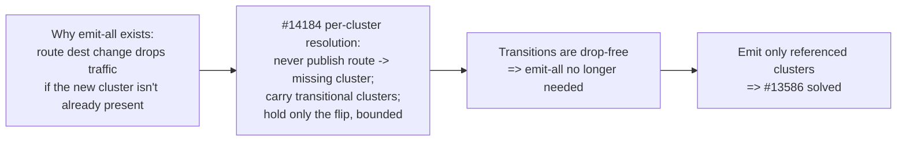

# EP-13586: Referenced-only cluster discovery

Status: Proposed

- Issue: [#13586](https://github.com/kgateway-dev/kgateway/issues/13586)
- Related: [#10639](https://github.com/kgateway-dev/kgateway/issues/10639) (duplicate ask), [#14184](https://github.com/kgateway-dev/kgateway/issues/14184) (the per-client xDS coherence work this builds on)
- Depends on: [#14343](https://github.com/kgateway-dev/kgateway/pull/14343) (shared-base + per-client-overlay cluster translation), [#14257](https://github.com/kgateway-dev/kgateway/pull/14257) (EDS/CDS alignment), and the #14184 per-client publication engine (per-cluster resolution + bounded publish gates; supersedes [#14237](https://github.com/kgateway-dev/kgateway/pull/14237)). Enabled by merged [#14242](https://github.com/kgateway-dev/kgateway/pull/14242) / [#14253](https://github.com/kgateway-dev/kgateway/pull/14253) (validator cache).

## Background

By default kgateway emits an Envoy CDS cluster (and an EDS `ClusterLoadAssignment`) for **every** Service in its discovery scope, whether or not any route references it. A user inspecting `config_dump` sees a cluster for every Service in the cluster.

The cost is real and reported in #13586. One environment measured:

- ~279 Services discovered, of which only 16 are targeted by an `HTTPRoute`.
- 93,126 metrics carrying an `envoy_cluster_name` label on each Envoy instance — more than the entire `kube-state-metrics` deployment — multiplied per replica.

The cost scales multiplicatively: it is paid per proxy replica, per gateway, so fleets with many gateways carry the full unreferenced inventory in every proxy's memory and in the control plane's per-client snapshots.

The two existing mitigations are insufficient for common topologies:

- `statsMatcher` (GatewayParameters) trims stats but is capped at 16 expressions and is brittle as internal Service names churn.
- `discoveryNamespaceSelectors` scopes discovery by namespace, which does not help when public and internal workloads share namespaces.

### Why kgateway emits all clusters today

This is deliberate, not accidental. The maintainer rationale (issue thread): there is no safe way to change a route's destination without dropping traffic unless the destination cluster already exists. Consider `/foo: service-a -> service-b`:

- The route update (RDS) and the cluster update (CDS) are applied to Envoy as separate events.
- If the route flips to `service-b` before `service-b`'s cluster exists, `/foo` returns `503 NC` (no cluster) for the gap.

Pre-creating a cluster for every Service guarantees the destination always exists, so route changes never reference a missing cluster. **Emit-all is a make-before-break workaround for not having safe cluster/route transitions.**

### Why this is now solvable: the #14184 machinery, concretely

The #14184 work replaced the "publish only when complete" whole-snapshot gate with **per-cluster resolution and bounded publication**. The relevant, already-implemented pieces this EP reuses (paths relative to `pkg/kgateway/proxy_syncer/`):

- `collectReferencedClusters(routes, listeners envoycache.Resources)` (`perclient.go`) walks the **generated** RDS/LDS protos (including `typed_config` extensions, via protoreflect) and returns the set of cluster names the dataplane references. Its output is computed once per gateway and stored on `GatewayXdsResources.ReferencedClusters`; deferred wrappers carry the unresolved subset as `XdsSnapWrapper.missingReferenced` / `missingEndpointsReferenced`.
- `resolveDeferredPerCluster` (`kube_gw_translator_syncer.go`) is the make-before-break primitive. Given a build with unready references and the currently-published snapshot, it decides per cluster: previously-published clusters that vanished from the build are carried forward together with their CLAs; previously-referenced clusters publish their truth; and only a route flip onto a newly-referenced, not-yet-present cluster is held — routes/listeners/secrets stay at their published versions while the new CDS/EDS goes out. A route is never published pointing at a cluster that is not in the snapshot, and the held flip is published in a **later** snapshot than the CDS that carries its destination.
- `publishGate` (`publish_gate.go`) serializes all snapshot-cache mutations per client under one lock, bounds the cold-start first publish with `KGW_PER_CLIENT_PUBLISH_BUDGET`, and arms a **flip-release timer** per held-flip episode: at expiry the latest held wrapper is re-resolved with holds disabled, so a hold is always bounded. `clientDeparted` cleans up per-client state on disconnect. This is the template for any per-client timed publication state.
- `filterEndpointResourcesForClusters` (`perclient.go`) positively aligns the emitted EDS set to the emitted CDS set (dropping CLAs for clusters not in CDS, synthesizing empty CLAs for EDS clusters with no derived CLA yet) — so shrinking CDS shrinks EDS automatically. The engine's readiness semantics are **strict presence**: a derived-but-empty CLA is publishable truth (a legitimately empty backend never defers, never holds a flip); only genuinely *absent* resources defer. That matters at scale: referenced-only emission still emits referenced-but-empty backends, and they must not put clients into a perpetual deferred state.
- #14343 restructures per-client cluster translation into a shared `baseEnvoyCluster` collection plus sparse per-client `uccClusterDelta`s, merged at snapshot assembly by `FetchClustersForClient`. Per-client CDS is materialized at assembly time — which is exactly where an emission filter is cheapest to apply.

Together these mean cluster/route transitions are already drop-free **for the clusters the snapshot chooses to emit**. #14184 sized that emitted set to "all backends"; this EP sizes it to "referenced clusters" and lets the same machinery carry the transitions. The justification for emit-all disappears.

## Motivation

### Goals

- Emit CDS/EDS only for clusters the generated Envoy configuration actually references, eliminating the unreferenced-cluster bloat in `config_dump` and `/stats`.
- Preserve make-before-break across route destination changes (no `503 NC`, no endpoint drops) by reusing the #14184 per-cluster resolution primitives rather than emit-all.
- Make the behavior opt-in via a setting, so the default is unchanged until the feature is proven.

### Non-Goals

- Changing how Services are watched/discovered at the informer level. This EP filters what is *emitted*, not what is *watched*. Coarser watch-level scoping remains the job of `discoveryNamespaceSelectors` and the proposed Service label selector (see Alternatives).
- A user-facing `Backend` kube type for explicit cluster declaration (see Alternatives, Option C).
- Solving the per-client publication freeze itself — that is #14184. This EP consumes its output.

## Key insight



A cluster set that is coherent-by-construction with the routes **is** the referenced-only set. #13586 reduces to "assemble the emitted set from `collectReferencedClusters`, and let the per-cluster resolution plus two grace windows transition that set safely."

## Design

### Defining the referenced set

The emitted cluster set for a gateway is the **transitive closure of cluster names referenced by that gateway's generated Envoy configuration** — the output of a `collectReferencedClusters`-style walk over the produced RDS/LDS/filter protos, not the set of route `backendRefs`.

This distinction is load-bearing. A correct referenced set must include every cluster Envoy can route to or call:

- route targets: `RouteAction.Cluster`, `WeightedCluster` entries, `TcpProxy.Cluster` (HTTP/GRPC/TCP/TLS routes, including delegated routes);
- request-mirror / shadow backends;
- ancillary clusters referenced by filter configs: `ext_authz`, `ext_proc`, rate-limit service, access-log gRPC sinks, JWKS, etc.;
- `wellknown.BlackholeClusterName`, unconditionally — routes whose backends failed resolution target it, so it must always be emitted.

The existing `collectReferencedClusters` (`perclient.go`) intentionally **excludes** ancillary references (logging, jwks, ext_authz) because it feeds the readiness/carry-forward decision, where those are not part of the route-reachability contract. For **emission** they are real clusters Envoy needs. This EP therefore adds an emission variant — `collectReferencedClustersForEmission` — that reuses the same protoreflect traversal (`collectResourceClusterReferences` / `collectProtoClusterReferences`) but does not drop ancillary references, and stores it alongside the existing field as `GatewayXdsResources.ReferencedClustersForEmission`.

Deriving the set from the produced protos (rather than re-resolving `backendRefs`) is correct by construction: we emit exactly the clusters the config names, so we never emit an unreferenced cluster nor drop a referenced one, and delegation / non-HTTP routes / mirrors are covered for free because they already appear in the generated protos.

### Emission filter

With #14343, cluster translation is a shared base (one `baseEnvoyCluster` per backend) plus sparse per-client deltas; the per-client CDS map is materialized at snapshot assembly, where `FetchClustersForClient` merges the two. The emission filter applies at that materialization point: the per-client cluster-resources transform in `snapshotPerClient` fetches the gateway's `ReferencedClustersForEmission` (by `ucc.Role`, the same `krt.FetchOne` pattern already used for the gateway snapshot) and skips any entry whose Envoy cluster name is not in the set (or in a de-reference grace window, below).

Two properties fall out of filtering at assembly rather than in translation:

- Base translation stays O(number of backends), computed once and shared; nothing per-client is ever built for an unreferenced backend, so both proxy config size **and** per-client control-plane snapshot size shrink to the referenced set.
- EDS follows automatically: `filterEndpointResourcesForClusters` already restricts emitted EDS to the emitted CDS set.

Cluster-name mapping: the filter compares against the backend's Envoy cluster name (the same name the referenced-set walk produces), so a referenced name and an emitted name are compared on the identical key.

### Safe transitions (reusing the #14184 primitives)

The referenced set changes as routes change. Both directions must be drop-free.

A coherent snapshot is necessary but **not sufficient**. Snapshot coherence is a property of *content*; drop-free transitions also require *delivery order*, which is a separate concern (see the Delivery ordering section below). Both directions therefore get a grace window: additions a **reference-ahead** window (publish the cluster strictly before the route that uses it), removals a **de-reference** window (drop the route strictly before the cluster). Without the windows, transitions have a bounded transient blip rather than being drop-free.

Addition (a route starts referencing `service-b`):

- `service-b` enters `ReferencedClustersForEmission`, so assembly emits its cluster in the same coherent snapshot as the new route.
- If per-client derivation for `service-b` lags the route change within a build, the engine already covers it: `service-b` is referenced but absent, so the flip is held and the new CDS goes out first (`resolveDeferredPerCluster`), bounded by the flip-release timer.
- The remaining gap is delivery order when cluster and flip land in **one** snapshot: Envoy can apply the RDS before the CDS (see below). The reference-ahead window closes it by extending the *existing* flip-hold primitive with a second trigger: hold the flip not only when the new cluster is absent from the build, but also when it is newly **emitted** and its delivery has not yet been given time to land (window-gated v1; CDS-ACK-gated refinement). The release is the same flip-release mechanism the engine already has — this EP adds a trigger and a release condition, not a new subsystem.

Removal (a route stops referencing `service-a`):

- `service-a` leaves `ReferencedClustersForEmission`. Removing it immediately is unsafe: the delivered type order is CDS before RDS (probed; see below), so the cluster would be removed before the old route stops using it, dropping in-flight `/foo` traffic.
- A **de-reference grace window** retains the cluster for a bounded period after it leaves the set, then prunes it. The emitted set is `referenced-now ∪ recently-de-referenced(within grace)`. This is the removal-side fix regardless of delivery ordering.

The grace mechanism follows the `publishGate` pattern (per-client keyed state + timer + publish under the gate's lock), which replaced the earlier reconcile-tick design:

- A small per-client `dereferencedAt map[string]time.Time` records when each cluster left the referenced set; re-referencing clears the entry, so a flapping route keeps its cluster present rather than oscillating.
- Expiry is timer-driven: when a grace window elapses, the gate re-publishes the client's snapshot without the pruned cluster, under the same lock as all other publications, so pruning can never race a coherent publish.

### Delivery ordering (the real correctness dependency)

Putting CDS and RDS in one coherent snapshot does not make Envoy *apply* CDS first. The mechanics were pinned empirically with deterministic wire-order probes against the real go-control-plane `server.StreamAggregatedResources` (20/20 runs per scenario, in both server modes):

- **Quiet streams are already type-ordered, in both server modes.** The `ads=true` `SnapshotCache` sorts the responses it pushes by type (`go-control-plane/pkg/cache/v3/order.go`), and on an otherwise-idle stream those writes reach the wire CDS-before-RDS even in the non-ordered server. The non-ordered server's `reflect.Select` drain randomizes only when several per-type channels are ready **simultaneously** — busy streams: a response stalled in gRPC flow control, or bursts of back-to-back snapshots. `WithOrderedADS()` closes exactly that residual window by routing all types through one FIFO.
- **ACK skew defeats both modes, deterministically.** After a CDS response is sent, its watch is closed until Envoy ACKs it. If the next snapshot (new cluster + route retarget) lands in that window, the only open watch is RDS, so the route referencing `service-b` reaches the wire **before** any CDS carrying `service-b` — with or without `WithOrderedADS` (probed). SotW can only answer open watches; no server option closes this. The window is reachable exactly when a route is retargeted to a not-yet-emitted cluster while any earlier CDS-only update is still un-ACKed — routine under CDS churn.
- Consequence: on a route addition, Envoy can apply RDS (`/foo -> service-b`) before CDS (`service-b`) and return `503 NC` for the gap; cluster warming (EDS) can extend it. This is why emit-all is drop-free today — the destination cluster was delivered *and ACKed* long before any route referenced it, so neither intra-batch order nor ACK skew matters. Referenced-only removes that immunity.

Three ways to handle the addition side:

1. **Accept a bounded transition blip (opt-in).** Steady state is unaffected; only a route edit that introduces a not-yet-present cluster blips, bounded by CDS/RDS delivery skew plus warming. This is the pragmatic default for users who value lean config over zero-blip route edits.
2. **Enable ordered ADS** (`WithOrderedADS()`). Necessary hardening for busy streams, but **not sufficient**: it does not close the ACK-skew window (above), and its fixed CDS-before-RDS order is the wrong order for removals. On its own it narrows the blip; it does not eliminate it.
3. **Reference-ahead grace (the actual drop-free mechanism).** When the referenced set grows and routes change in the same build, publish the enlarged CDS/EDS first with the *previous* RDS, and release the flip after the reference-ahead window (or, more precisely, once the CDS carrying the new cluster is ACKed — the server callbacks observe per-type ACKs). This recreates, for exactly the transitional cluster, the property emit-all provided globally: the destination is delivered and ACKed before any route names it. It is the same "hold only the flip" shape — and the same bounded flip-release — that `resolveDeferredPerCluster` and `publishGate` already implement for not-yet-derived clusters, and it subsumes ordered ADS whenever the window exceeds delivery+ACK latency.

The robust, drop-free configuration is therefore **reference-ahead grace (addition safety) plus de-reference grace (removal safety)**, with `WithOrderedADS` as optional defense-in-depth for busy streams. Ordered ADS is not, on its own, an addition-side fix. Shipping referenced-only with neither grace is viable as the opt-in trade-off but must be documented as having a transient transition blip, not as make-before-break.

### Worked example

```mermaid
sequenceDiagram
    participant R as Route /foo
    participant T as Translator (coherent assembly)
    participant E as Envoy (ADS)
    Note over R: /foo: service-a -> service-b
    R->>T: route now references b, not a
    T->>T: ReferencedForEmission = {..., b}; dereferencedAt[a]=now
    T->>T: emit set = referenced ∪ grace = {..., a, b}
    T->>E: snapshot 1 {CDS: a,b ; RDS: /foo->a (flip held)}
    E->>T: ACK CDS (b applied and warmed; no route uses it yet)
    Note over T: reference-ahead window elapsed (or CDS ACK observed)
    T->>E: snapshot 2 {CDS: a,b ; RDS: /foo->b}
    Note over E: b already applied+ACKed -> the flip cannot 503 NC,\nregardless of server mode or ACK skew.\na still present (de-reference grace), so in-flight to a is safe
    Note over T: de-reference grace timer fires for a
    T->>E: snapshot 3 {CDS: b (a pruned)}
    E->>E: a removed only after no applied route uses it
```

### Configuration

A new setting gates the behavior, defaulting to today's emit-all so nothing changes implicitly:

- `KGW_CLUSTER_DISCOVERY_MODE` (`Settings.ClusterDiscoveryMode`, `api/settings/settings.go`), enum `All` (default) | `Referenced`, following the existing typed-enum + `Decode` pattern used by `ValidationMode`.
- `Referenced` activates the emission filter and both transition graces.
- `KGW_CLUSTER_DEREFERENCE_GRACE` (`Settings.ClusterDereferenceGrace`, `metav1.Duration`, default a few seconds) tunes the removal-side grace to the deployment's RDS propagation latency; `0` disables it (only safe when the operator accepts the removal race).
- `KGW_CLUSTER_REFERENCE_AHEAD` (`Settings.ClusterReferenceAhead`, `metav1.Duration`, default a few seconds) tunes the addition-side flip hold; `0` publishes cluster and flip in one snapshot, accepting the ACK-skew/busy-stream blip. The two windows are separate knobs because they trade different things: de-reference grace trades config-dump residency, reference-ahead trades route-edit latency. The reference-ahead hold is bounded by the engine's existing flip-release deadline, so a misconfigured window can never hold a flip indefinitely.

## What #14184 already provides versus what this EP adds

| Concern | Already implemented (symbol / PR) | Added by this EP |
|---|---|---|
| Compute referenced-cluster set from generated protos | `collectReferencedClusters` + `GatewayXdsResources.ReferencedClusters` (#14184 engine) | `collectReferencedClustersForEmission` (include ancillary + blackhole) + `ReferencedClustersForEmission` |
| Never publish route -> missing cluster; carry transitional clusters; hold only the flip | `resolveDeferredPerCluster` (#14184 engine) | Reused; new hold trigger for newly-emitted clusters |
| Bounded, serialized publication; per-client timed state | `publishGate` (first-publish budget, flip-release timer, `clientDeparted`) | Reused; reference-ahead release condition + de-reference gate modeled on it |
| EDS aligned to emitted CDS; empty-CLA truth semantics | `filterEndpointResourcesForClusters`, strict presence semantics (#14257 + engine) | Reused; EDS follows the filtered CDS automatically |
| Shared-base cluster translation; per-client materialization at assembly | #14343 `baseEnvoyCluster` / `uccClusterDelta` / `FetchClustersForClient` | Emission filter applied at the assembly merge |
| Deferrals stay short (so transitions are quick) | validator cache (#14242 / #14253, merged) | Reused |
| Filter per-client CDS/EDS to the referenced set | none (assembly emits all backends) | New filter at assembly, behind the setting |
| De-reference grace (retain recently-unreferenced, then prune) | none (engine only carries referenced-but-absent) | New `dereferencedAt` state + timer-driven prune on the gate |
| Reference-ahead grace (publish new cluster before the route flip) | Flip-hold + flip-release exist for not-yet-derived clusters | New trigger (newly-emitted) + window/ACK release |
| Opt-in setting | none | `ClusterDiscoveryMode`, `ClusterDereferenceGrace`, `ClusterReferenceAhead` |

The heavy lifting (per-cluster resolution, carry-forward, bounded holds, EDS alignment, publication serialization) is done. This EP is a referenced-set filter plus a grace policy on top of the existing gate.

## Implementation and rollout

Phased so each step is independently reviewable and revertible, and nothing user-visible ships before the #14184 foundation is merged.

### Phase 0: foundation (prerequisite, in flight)

- Merge #14343 (shared-base + overlay cluster translation), #14257 (EDS/CDS alignment), and the #14184 publication-engine PR (per-cluster resolution + `publishGate`, with strict presence semantics for empty CLAs). The merged validator cache (#14242/#14253) keeps deferral windows short.
- Exit criterion: all three on `main`; `resolveDeferredPerCluster`, `publishGate`, `filterEndpointResourcesForClusters`, and `FetchClustersForClient` present; steady-state-empty referenced backends publish as truth (no perpetual deferral), since referenced-only emission does not remove referenced-but-empty backends.

### Phase 1: emission-scoped referenced set

- Add `collectReferencedClustersForEmission` in `perclient.go` reusing the existing traversal, without the ancillary exclusion and always including `wellknown.BlackholeClusterName`; unit-test that its closure includes route targets, weighted clusters, TCP/TLS targets, mirror backends, and ancillary filter clusters (ext_authz/ext_proc/ratelimit/access-log/jwks).
- Store it as `GatewayXdsResources.ReferencedClustersForEmission` in `toResources` (`proxy_syncer.go`), next to the existing `ReferencedClusters`.
- No behavior change yet (nothing consumes it). Ships dark.

### Phase 2: emission filter behind the setting

- Add `ClusterDiscoveryMode` (`All` default) to `api/settings/settings.go` with `Decode`; regenerate settings artifacts.
- Apply the filter at per-client assembly: the cluster-resources transform in `snapshotPerClient` fetches the role's `ReferencedClustersForEmission` and skips non-members when mode is `Referenced`. EDS follows via `filterEndpointResourcesForClusters`.
- Tests: with mode `Referenced`, an unreferenced backend yields no cluster/CLA in the per-client snapshot; `All` is byte-identical to today. Integration (envtest + ADS): a route add produces the new cluster before the route (no `503 NC`).
- At this point removals are not yet safe, so document `Referenced` as experimental until Phase 3.

### Phase 3: transition graces (de-reference and reference-ahead)

- Add the de-reference gate: `dereferencedAt` per-client state on (or alongside) `publishGate`, updated when a cluster leaves `ReferencedClustersForEmission`, cleared on re-reference; the emission filter admits graced clusters; a timer prunes and re-publishes when the window elapses, under the gate's lock.
- Add the reference-ahead trigger to the existing flip-hold: when a build both enlarges the emitted cluster set and changes RDS/LDS to reference the new clusters, hold the flip (publishing the enlarged CDS/EDS with the previously-published RDS/LDS) and release it via the existing flip-release path after `ClusterReferenceAhead` (v1: window-gated; CDS-ACK-gated via server callbacks as a follow-up refinement).
- Add `ClusterDereferenceGrace` and `ClusterReferenceAhead` settings.
- Tests: route flip `a -> b` yields snapshot 1 with CDS `{a,b}` + RDS still `-> a`, snapshot 2 with RDS `-> b`, then a later snapshot with `a` pruned; a flapping route does not oscillate; port a deterministic ADS wire-order probe harness into the proxy_syncer test suite and drive the emission path through the ACK-skew scenario, asserting the flip is never delivered before its cluster; integration confirms no endpoint gap on the stable path through churn across HTTP/GRPC/TCP/TLS.

### Phase 4: observability, docs, default

- Add counters: emitted-cluster count per gateway, graced/pruned cluster events, and reference-ahead hold/release events (the engine's `flips_held` / bounded-publish counters already cover the hold mechanics), so operators can see the reduction and the grace activity.
- Document the make-before-break guarantee, the grace settings, and the behavior change (unreferenced Services no longer appear as clusters).
- Keep `All` as the default. Consider flipping the default to `Referenced` only after a soak with the load matrix below green.

## Alternatives

### Option B: Service label selector (complementary, ship independently)

Extend discovery scoping with a Service label selector (sibling to `discoveryNamespaceSelectors`), wired into the kube backend plugin (`pkg/kgateway/extensions2/plugins/kubernetes/k8s.go`) so unmatched Services never become a backend and therefore never a cluster. This is the ask from the reporter with the 93k-metric environment.

- Pros: small, no coherence dependency (the operator controls the set explicitly, so there is no transition to make drop-free); finer than namespace scoping; ships now, independent of #14184.
- Cons: operator must label workloads and keep labels current; opt-in scoping, not automatic.

This EP and Option B are not mutually exclusive. Option B is the quick standalone win; referenced-only is the automatic model. A reasonable sequence is Option B now, referenced-only once Phase 0 lands.

### Option C: explicit `Backend` kube type plus disable-discovery

Add a kube-type `Backend` resource so users declare which Services become clusters, plus a setting to disable auto-discovery entirely (maintainer suggestion in the issue thread). Maximal control, largest UX change.

### Status quo mitigations

`statsMatcher` and `discoveryNamespaceSelectors`, already shown insufficient for shared-namespace topologies and capped expression lists.

## Risks and trade-offs

- **Referenced-set completeness is the principal correctness risk.** Missing an ancillary cluster reference (a new filter type that names a cluster) would drop a cluster Envoy needs. `collectReferencedClustersForEmission` must be derived from the produced protos and kept in step with any new cluster-referencing filter; this warrants a dedicated closure-completeness test that fails when a filter introduces an uncovered reference. The blackhole cluster must be unconditionally emitted.
- **Delivery ordering is the sharpest risk (see Delivery ordering).** A coherent snapshot does not guarantee Envoy applies CDS before RDS: busy streams randomize the non-ordered server's drain, and ACK skew delivers the route flip before its cluster in **both** server modes (probed deterministically). Emit-all is immune (destinations pre-exist, pre-ACKed); referenced-only is not. Mitigated by the reference-ahead grace (with `WithOrderedADS` as busy-stream hardening) or accepted as a bounded opt-in blip. `WithOrderedADS` alone is not a fix.
- **Removal correctness depends on the grace window, not on delivery ordering.** The delivered type order is CDS-before-RDS in both server modes (cache type-sorted writes; probed), which is the wrong order for removals; the grace window is the removal-side fix and must exceed worst-case RDS propagation. It is configurable for this reason.
- **Referenced-but-empty backends must remain publishable truth.** Referenced-only emission does not remove backends that are referenced but legitimately empty (scale-to-zero, ExternalName-style always-empty). The engine's strict presence semantics guarantee these never defer publication or hold flips; any future strengthening of readiness semantics must preserve that, or fleets with such backends would regress into perpetual deferral.
- **Backends needing policy status.** A backend with an attached policy but no route reference still needs its status reconciled; status computation must remain independent of the emission filter.
- **Behavior change.** Unreferenced Services disappear from `config_dump` and `/stats`; dashboards or scripts relying on their presence will notice. Intended, hence opt-in.
- **Grace churn.** Flapping routes are handled by clearing `dereferencedAt` on re-reference (present, not oscillating).

## Test plan

- Unit: `collectReferencedClustersForEmission` closure completeness (route targets, weighted, TCP/TLS, mirror, ancillary filters, blackhole).
- Unit: emission filter skips unreferenced backends in `Referenced`, no-ops in `All`; retains graced backends; prunes after grace via the gate timer.
- Unit: route flip `a -> b` snapshot sequence (both, then pruned); flap does not oscillate; reference-ahead hold released by window expiry and bounded by the flip-release deadline.
- Wire order: a deterministic ADS wire-order probe harness (ported into the proxy_syncer test suite) drives the emission path through the ACK-skew and combined-removal scenarios, asserting a route flip is never delivered before its cluster and a cluster removal never before its de-referencing RDS.
- Integration (envtest + ADS): route destination change produces no `503 NC` and no endpoint gap in `Referenced`, across HTTP/GRPC/TCP/TLS and delegated routes.
- e2e/load: the #13586 shape (hundreds of Services, a handful routed) yields cluster/metric counts proportional to referenced Services, with stable traffic through route churn; include referenced-but-empty backends to pin the no-deferral guarantee.
- Regression: `All` mode byte-identical to today.

## Open questions

- **Prune versus indefinite carry-forward** for de-referenced clusters. This EP uses time-bounded grace-then-prune; the alternative (retain until a positive signal) is the open decision from the #14184 design notes and should be settled here, since it shapes removal semantics.
- **Default durations for the two windows**, and whether to derive them from observed per-type ACK latency (the server callbacks expose it) rather than static values. Large fleets with batch route churn are the environments where measured-ACK-derived windows matter most.
- **Window-gated versus ACK-gated reference-ahead.** The window version is simple and subsumes ordered ADS statistically; the ACK-gated version is exact (release the flip when the CDS carrying the new cluster is ACKed) but couples publish sequencing to per-stream ACK state. This EP proposes window-gated v1, ACK-gated as a refinement.
- **Whether the reference-ahead window and the engine's flip-release deadline should be one knob or two.** They are the same bounded-hold primitive with different release conditions; this EP keeps them separate (the deadline is a safety bound, the window a pacing control) but a single-knob simplification is plausible.
- **Whether to ship Option B (Service label selector) first** as the immediate mitigation while this lands.
- **Whether to also enable ordered ADS (`WithOrderedADS`)** as busy-stream hardening alongside the graces — it cannot make additions drop-free on its own (ACK skew, probed), so the question is narrowly whether its latency/behavior change for all clients is worth the narrowed blip for users who opt out of reference-ahead.
