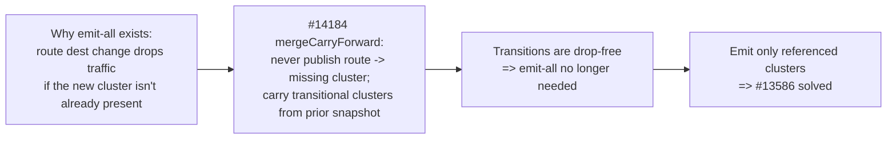

# EP-13586: Referenced-only cluster discovery

Status: Proposed

- Issue: [#13586](https://github.com/kgateway-dev/kgateway/issues/13586)
- Related: [#10639](https://github.com/kgateway-dev/kgateway/issues/10639) (duplicate ask), [#14184](https://github.com/kgateway-dev/kgateway/issues/14184) (the per-client xDS coherence work this builds on)
- Depends on PRs: [#14237](https://github.com/kgateway-dev/kgateway/pull/14237) (bounded publish + carry-forward + warm preservation), [#14257](https://github.com/kgateway-dev/kgateway/pull/14257) (EDS/CDS alignment + usable-endpoint) — the latter is folded into the former. Enabled by merged [#14242](https://github.com/kgateway-dev/kgateway/pull/14242) / [#14253](https://github.com/kgateway-dev/kgateway/pull/14253) (validator cache).

## Background

By default kgateway emits an Envoy CDS cluster (and an EDS `ClusterLoadAssignment`) for **every** Service in its discovery scope, whether or not any route references it. A user inspecting `config_dump` sees a cluster for every Service in the cluster.

The cost is real and reported in #13586. One environment measured:

- ~279 Services discovered, of which only 16 are targeted by an `HTTPRoute`.
- 93,126 metrics carrying an `envoy_cluster_name` label on each Envoy instance — more than the entire `kube-state-metrics` deployment — multiplied per replica.

The two existing mitigations are insufficient for common topologies:

- `statsMatcher` (GatewayParameters) trims stats but is capped at 16 expressions and is brittle as internal Service names churn.
- `discoveryNamespaceSelectors` scopes discovery by namespace, which does not help when public and internal workloads share namespaces.

### Why kgateway emits all clusters today

This is deliberate, not accidental. The maintainer rationale (issue thread): there is no safe way to change a route's destination without dropping traffic unless the destination cluster already exists. Consider `/foo: service-a -> service-b`:

- The route update (RDS) and the cluster update (CDS) are applied to Envoy as separate events.
- If the route flips to `service-b` before `service-b`'s cluster exists, `/foo` returns `503 NC` (no cluster) for the gap.

Pre-creating a cluster for every Service guarantees the destination always exists, so route changes never reference a missing cluster. **Emit-all is a make-before-break workaround for not having safe cluster/route transitions.**

### Why this is now solvable: the #14184 machinery, concretely

The #14184 work (PR #14237, building on the merged validator cache #14242/#14253) replaced the "publish only when complete" gate with **coherence-by-construction** in the per-client publish path. The relevant, already-implemented pieces this EP reuses (paths relative to `pkg/kgateway/proxy_syncer/`):

- `collectReferencedClusters(routes, listeners envoycache.Resources)` (`perclient.go`) walks the **generated** RDS/LDS protos and returns the set of cluster names the dataplane references. Its output is already stored on `GatewayXdsResources.ReferencedClusters` (`proxy_syncer.go`, set in `toResources`) and carried on deferred wrappers as `XdsSnapWrapper.referencedClusters` (`xdswrapper.go`).
- `mergeCarryForward(wrap *XdsSnapWrapper, published envoycache.ResourceSnapshot)` (`kube_gw_translator_syncer.go`) produces a snapshot in which any referenced cluster (and its EDS) missing from the current build is carried forward from the previously published snapshot. This is the make-before-break primitive: a route is never published pointing at a cluster that is not in the snapshot.
- `publishBudgetGate` / `clientPublishState` / `syncXds` / `offerBudgetedPublish` / `publishPendingBudgeted` (`kube_gw_translator_syncer.go`) serialize all publication decisions under one lock, so a transitional merge can never race a coherent publish, and `clientDeparted` cleans up on disconnect.
- `filterEndpointResourcesForClusters(clusters, endpoints envoycache.Resources)` and `clusterLoadAssignmentHasUsableEndpoint(...)` (`perclient.go`, from #14257) already positively align the emitted EDS set to the emitted CDS set and treat empty CLAs correctly.

Together these mean cluster/route transitions are already drop-free **for the clusters the snapshot chooses to emit**. #14184 sized that emitted set to "all backends"; this EP sizes it to "referenced clusters" and lets the same machinery carry the transitions. The justification for emit-all disappears.

## Motivation

### Goals

- Emit CDS/EDS only for clusters the generated Envoy configuration actually references, eliminating the unreferenced-cluster bloat in `config_dump` and `/stats`.
- Preserve make-before-break across route destination changes (no `503 NC`, no endpoint drops) by reusing the #14184 `mergeCarryForward` primitive rather than emit-all.
- Make the behavior opt-in via a setting, so the default is unchanged until the feature is proven.

### Non-Goals

- Changing how Services are watched/discovered at the informer level. This EP filters what is *emitted*, not what is *watched*. Coarser watch-level scoping remains the job of `discoveryNamespaceSelectors` and the proposed Service label selector (see Alternatives).
- A user-facing `Backend` kube type for explicit cluster declaration (see Alternatives, Option C).
- Solving the per-client publication freeze itself — that is #14184. This EP consumes its output.

## Key insight



A cluster set that is coherent-by-construction with the routes **is** the referenced-only set. #13586 reduces to "assemble the emitted set from `collectReferencedClusters`, and let `mergeCarryForward` plus a de-reference grace transition that set safely."

## Design

### Defining the referenced set

The emitted cluster set for a gateway is the **transitive closure of cluster names referenced by that gateway's generated Envoy configuration** — the output of a `collectReferencedClusters`-style walk over the produced RDS/LDS/filter protos, not the set of route `backendRefs`.

This distinction is load-bearing. A correct referenced set must include every cluster Envoy can route to or call:

- route targets: `RouteAction.Cluster`, `WeightedCluster` entries, `TcpProxy.Cluster` (HTTP/GRPC/TCP/TLS routes, including delegated routes);
- request-mirror / shadow backends;
- ancillary clusters referenced by filter configs: `ext_authz`, `ext_proc`, rate-limit service, access-log gRPC sinks, JWKS, etc.

The existing `collectReferencedClusters` (`perclient.go`) intentionally **excludes** ancillary references (logging, jwks, ext_authz) because it feeds the readiness/carry-forward decision, where those are not part of the route-reachability contract. For **emission** they are real clusters Envoy needs. This EP therefore adds an emission variant — `collectReferencedClustersForEmission` — that reuses the same `walkProtoMessages` traversal but does not drop ancillary references, and stores it alongside the existing field as `GatewayXdsResources.ReferencedClustersForEmission`.

Deriving the set from the produced protos (rather than re-resolving `backendRefs`) is correct by construction: we emit exactly the clusters the config names, so we never emit an unreferenced cluster nor drop a referenced one, and delegation / non-HTTP routes / mirrors are covered for free because they already appear in the generated protos.

### Emission filter

Cluster and endpoint generation is per connected client (UCC). Today the transforms iterate every backend in `finalBackends`:

- `NewPerClientEnvoyClusters(... finalBackends krt.Collection[*ir.BackendObjectIR] ...)` (`backends.go`) — `krt.NewManyCollection(finalBackends, ...)` emits one cluster per backend per UCC.
- the per-client EDS counterpart for `ClusterLoadAssignment`s.

The filter applies the gateway's `ReferencedClustersForEmission` set inside these transforms: a backend whose Envoy cluster name is not in the set (and not within a de-reference grace window, below) is skipped. The set is threaded in from the gateway snapshot with the same `krt.FetchOne` pattern the per-client transforms already use for gateway-scoped inputs. EDS is kept aligned automatically because `filterEndpointResourcesForClusters` (#14257) already restricts the emitted EDS to the emitted CDS set.

Cluster-name mapping: the filter compares against the backend's Envoy cluster name (the same `endpointResourceNameForCluster` / cluster-name derivation the snapshot already uses), so a referenced name and an emitted name are compared on the identical key.

### Safe transitions (reusing the #14184 primitive)

The referenced set changes as routes change. Both directions must be drop-free.

Addition (a route starts referencing `service-b`):

- `service-b` enters `ReferencedClustersForEmission`, so the per-client transform emits its cluster in the same coherent snapshot as the new route.
- If per-client cluster translation for `service-b` lags the route change within a build, `mergeCarryForward` already covers it: `service-b` is in `referencedClusters` but absent from the build, so it is carried forward (or the publish is withheld on cold start), exactly as #14184 does today. go-control-plane ADS then delivers CDS/EDS before LDS/RDS, so `service-b` exists before `/foo` is flipped to it. No `503 NC`.

Removal (a route stops referencing `service-a`):

- `service-a` leaves `ReferencedClustersForEmission`. Removing it immediately is unsafe: ADS may remove the cluster before the old route is replaced on Envoy, dropping in-flight `/foo` traffic.
- A **de-reference grace window** retains the cluster for a bounded period after it leaves the set, then prunes it. The emitted set is `referenced-now ∪ recently-de-referenced(within grace)`.

The grace mechanism extends the existing state, it does not add a new subsystem:

- `clientPublishState` (`kube_gw_translator_syncer.go`) gains a `dereferencedAt map[string]time.Time` (cluster name -> time it left the referenced set).
- The emission filter admits a cluster if it is referenced now, or was de-referenced within the grace window.
- Pruning after the window relies on the level-triggered reconcile tick already present from the #14184 work (the `PerClientHeartbeat` input to the per-client collections) so a steady state with no further events still re-evaluates and drops expired clusters.
- Flap handling: re-referencing a cluster clears its `dereferencedAt` entry, so a flapping route keeps the cluster present rather than oscillating.

### Worked example

```mermaid
sequenceDiagram
    participant R as Route /foo
    participant T as Translator (coherent assembly)
    participant E as Envoy (ADS)
    Note over R: /foo: service-a -> service-b
    R->>T: route now references b, not a
    T->>T: ReferencedForEmission = {..., b}; dereferencedAt[a]=now
    T->>T: emit set = referenced ∪ grace = {..., a, b}
    T->>E: snapshot {CDS: a,b ; RDS: /foo->b}
    E->>E: apply CDS (b present) then RDS (/foo->b)
    Note over E: no 503 NC; a still present for in-flight
    Note over T: PerClientHeartbeat tick after grace expires
    T->>E: snapshot {CDS: b (a pruned)}
    E->>E: apply CDS (a removed); no route uses a
```

### Configuration

A new setting gates the behavior, defaulting to today's emit-all so nothing changes implicitly:

- `KGW_CLUSTER_DISCOVERY_MODE` (`Settings.ClusterDiscoveryMode`, `api/settings/settings.go`), enum `All` (default) | `Referenced`, following the existing typed-enum + `Decode` pattern used by `ValidationMode` / `PodLocalityXDS`.
- `Referenced` activates the emission filter and the de-reference grace.
- `KGW_CLUSTER_DEREFERENCE_GRACE` (`Settings.ClusterDereferenceGrace`, `metav1.Duration`, default a few seconds) tunes the grace to the deployment's RDS propagation latency; `0` disables grace (only safe when the operator accepts the removal race).

## What #14184 already provides versus what this EP adds

| Concern | Already implemented (symbol / PR) | Added by this EP |
|---|---|---|
| Compute referenced-cluster set from generated protos | `collectReferencedClusters` + `GatewayXdsResources.ReferencedClusters` + `XdsSnapWrapper.referencedClusters` (#14237) | `collectReferencedClustersForEmission` (include ancillary) + `ReferencedClustersForEmission` |
| Never publish route -> missing cluster; carry transitional clusters | `mergeCarryForward`, `publishPendingBudgeted`, `publishBudgetGate` (#14237) | Reused unchanged for the addition side |
| EDS aligned to emitted CDS; empty-CLA handling | `filterEndpointResourcesForClusters`, `clusterLoadAssignmentHasUsableEndpoint` (#14257) | Reused; EDS follows the filtered CDS automatically |
| Level-triggered re-evaluation | `PerClientHeartbeat` reconcile tick (#14237 lineage) | Reused to prune after grace expiry |
| Deferrals stay short (so transitions are quick) | validator cache (#14242 / #14253, merged) | Reused |
| Filter per-client CDS/EDS to the referenced set | none (emits all `finalBackends`) | New filter in `NewPerClientEnvoyClusters` + EDS transform |
| De-reference grace (retain recently-unreferenced, then prune) | none (#14184 only carries referenced-but-absent) | New `dereferencedAt` state + grace policy on `clientPublishState` |
| Opt-in setting | none | `ClusterDiscoveryMode`, `ClusterDereferenceGrace` |

The heavy lifting (coherent publish, carry-forward, EDS alignment, reconcile tick) is done. This EP is a referenced-set filter plus a grace policy on top of `clientPublishState`.

## Implementation and rollout

Phased so each step is independently reviewable and revertible, and nothing user-visible ships before the #14184 foundation is merged.

### Phase 0: foundation (prerequisite, in flight)

- Merge #14237 (bounded publish + `mergeCarryForward` + warm preservation) and its folded-in #14257 (EDS/CDS alignment). These provide every reused symbol above; the merged validator cache (#14242/#14253) keeps deferral windows short.
- Exit criterion: #14237 merged to `main`; `mergeCarryForward` and `filterEndpointResourcesForClusters` present.

### Phase 1: emission-scoped referenced set

- Add `collectReferencedClustersForEmission` in `perclient.go` reusing `walkProtoMessages`, without the ancillary exclusion; unit-test that its closure includes route targets, weighted clusters, TCP/TLS targets, mirror backends, and ancillary filter clusters (ext_authz/ext_proc/ratelimit/access-log/jwks).
- Store it as `GatewayXdsResources.ReferencedClustersForEmission` in `toResources` (`proxy_syncer.go`), next to the existing `ReferencedClusters`.
- No behavior change yet (nothing consumes it). Ships dark.

### Phase 2: emission filter behind the setting

- Add `ClusterDiscoveryMode` (`All` default) to `api/settings/settings.go` with `Decode`; regenerate settings artifacts.
- Thread `ReferencedClustersForEmission` into `NewPerClientEnvoyClusters` (`backends.go`) and the per-client EDS transform via `krt.FetchOne` on the gateway snapshot; when mode is `Referenced`, skip backends whose cluster name is not in the set. EDS follows via `filterEndpointResourcesForClusters`.
- Tests: with mode `Referenced`, an unreferenced backend yields no cluster/CLA; `All` is byte-identical to today. Integration (envtest + ADS): a route add produces the new cluster before the route (no `503 NC`).
- At this point removals are not yet safe, so document `Referenced` as experimental until Phase 3.

### Phase 3: de-reference grace

- Add `dereferencedAt map[string]time.Time` to `clientPublishState`; update it when a cluster leaves `ReferencedClustersForEmission`; clear on re-reference.
- Admit graced clusters in the emission filter; prune on the `PerClientHeartbeat` tick once the window elapses.
- Add `ClusterDereferenceGrace` setting.
- Tests: route flip `a -> b` yields a snapshot with both `a` (grace) and `b`, then a later snapshot with `a` pruned; a flapping route does not oscillate; integration confirms no endpoint gap on the stable path through churn across HTTP/GRPC/TCP/TLS.

### Phase 4: observability, docs, default

- Add counters: emitted-cluster count per gateway, and graced/pruned cluster events, so operators can see the reduction and the grace activity.
- Document the make-before-break guarantee, the grace setting, and the behavior change (unreferenced Services no longer appear as clusters).
- Keep `All` as the default. Consider flipping the default to `Referenced` only after a soak with the load matrix below green.

## Alternatives

### Option B: Service label selector (complementary, ship independently)

Extend discovery scoping with a Service label selector (sibling to `discoveryNamespaceSelectors`), wired into the kube backend plugin (`pkg/kgateway/extensions2/plugins/kubernetes/k8s.go`) so unmatched Services never become a backend and therefore never a cluster. This is the ask from the reporter with the 93k-metric environment.

- Pros: small, no coherence dependency (the operator controls the set explicitly, so there is no transition to make drop-free); finer than namespace scoping; ships now, independent of #14184.
- Cons: operator must label workloads and keep labels current; opt-in scoping, not automatic.

This EP and Option B are not mutually exclusive. Option B is the quick standalone win; referenced-only is the automatic model. A reasonable sequence is Option B now, referenced-only once Phase 0 lands.

### Option C: explicit `Backend` kube type plus disable-discovery

Add a kube-type `Backend` resource so users declare which Services become clusters, plus a setting to disable auto-discovery entirely (maintainer suggestion in the issue thread). Maximal control, largest UX change.

### Status quo mitigations

`statsMatcher` and `discoveryNamespaceSelectors`, already shown insufficient for shared-namespace topologies and capped expression lists.

## Risks and trade-offs

- **Referenced-set completeness is the principal correctness risk.** Missing an ancillary cluster reference (a new filter type that names a cluster) would drop a cluster Envoy needs. `collectReferencedClustersForEmission` must be derived from the produced protos and kept in step with any new cluster-referencing filter; this warrants a dedicated closure-completeness test that fails when a filter introduces an uncovered reference.
- **Removal correctness depends on the grace window, not on Envoy ordering.** The grace must exceed worst-case RDS propagation; it is configurable for this reason.
- **Backends needing policy status.** A backend with an attached policy but no route reference still needs its status reconciled; status computation must remain independent of the emission filter.
- **Behavior change.** Unreferenced Services disappear from `config_dump` and `/stats`; dashboards or scripts relying on their presence will notice. Intended, hence opt-in.
- **Grace churn.** Flapping routes are handled by clearing `dereferencedAt` on re-reference (present, not oscillating).

## Test plan

- Unit: `collectReferencedClustersForEmission` closure completeness (route targets, weighted, TCP/TLS, mirror, ancillary filters).
- Unit: emission filter skips unreferenced backends in `Referenced`, no-ops in `All`; retains graced backends; prunes after grace via the reconcile tick.
- Unit: route flip `a -> b` snapshot sequence (both, then pruned); flap does not oscillate.
- Integration (envtest + ADS): route destination change produces no `503 NC` and no endpoint gap in `Referenced`, across HTTP/GRPC/TCP/TLS and delegated routes.
- e2e/load: the #13586 shape (hundreds of Services, a handful routed) yields cluster/metric counts proportional to referenced Services, with stable traffic through route churn.
- Regression: `All` mode byte-identical to today.

## Open questions

- **Prune versus indefinite carry-forward** for de-referenced clusters. This EP uses time-bounded grace-then-prune; the alternative (retain until a positive signal) is the open decision from the #14184 design notes and should be settled here, since it shapes removal semantics.
- **Default grace duration**, and whether to derive it from observed RDS ACK latency rather than a static value.
- **Whether to ship Option B (Service label selector) first** as the immediate mitigation while this lands.
