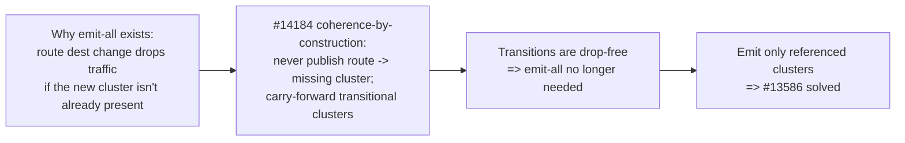

# EP-13586: Referenced-only cluster discovery

Status: Proposed

- Issue: [#13586](https://github.com/kgateway-dev/kgateway/issues/13586)
- Related: [#10639](https://github.com/kgateway-dev/kgateway/issues/10639) (duplicate ask), [#14184](https://github.com/kgateway-dev/kgateway/issues/14184) (the per-client xDS coherence work this builds on)

## Background

By default kgateway emits an Envoy CDS cluster (and an EDS `ClusterLoadAssignment`) for **every** Service in its discovery scope, whether or not any route references it. A user inspecting `config_dump` sees a cluster for every Service in the cluster.

The cost is real and reported in #13586. One environment measured:

- ~279 Services discovered, of which only 16 are targeted by an `HTTPRoute`.
- 93,126 metrics carrying an `envoy_cluster_name` label on each Envoy instance — more than the entire `kube-state-metrics` deployment — multiplied per replica.

The two existing mitigations are insufficient for common topologies:

- `statsMatcher` (GatewayParameters) trims stats but is capped at 16 expressions and is brittle as internal Service names churn.
- `discoveryNamespaceSelectors` scopes discovery by namespace, which does not help when public and internal workloads share namespaces.

### Why kgateway emits all clusters today

This is deliberate, not accidental. The maintainer rationale (issue thread): there is no safe way to change a route's destination without dropping traffic unless the destination cluster already exists. Consider `/foo: service-a -> service-b`:

- The route update (RDS) and the cluster update (CDS) are applied to Envoy as separate events.
- If the route flips to `service-b` before `service-b`'s cluster exists, `/foo` returns `503 NC` (no cluster) for the gap.

Pre-creating a cluster for every Service guarantees the destination always exists, so route changes never reference a missing cluster. **Emit-all is a make-before-break workaround for not having safe cluster/route transitions.**

### Why this is now solvable

[#14184](https://github.com/kgateway-dev/kgateway/issues/14184) introduced **coherence-by-construction** for the per-client xDS snapshot. The publish invariant changed from "publish only when complete" to "always publish a snapshot that is internally consistent by construction — referenced-but-absent clusters are carried forward from the last published snapshot, and no route is ever published pointing at a missing cluster." The supporting machinery (publish-time merge from the prior snapshot, version recomputation, all under a single gate lock) is the safe-transition primitive that was previously missing.

Once cluster/route transitions are drop-free, the justification for emit-all disappears. The emitted cluster set can be sized to exactly what the configuration references, with transitions handled by the #14184 primitive. That is what this EP proposes.

## Motivation

### Goals

- Emit CDS/EDS only for clusters the generated Envoy configuration actually references, eliminating the unreferenced-cluster bloat in `config_dump` and `/stats`.
- Preserve make-before-break across route destination changes (no `503 NC`, no endpoint drops) using the #14184 coherence machinery rather than emit-all.
- Make the behavior opt-in via a setting, so the default is unchanged until the feature is proven.

### Non-Goals

- Changing how Services are watched/discovered at the informer level. This EP filters what is *emitted*, not what is *watched*. Coarser watch-level scoping remains the job of `discoveryNamespaceSelectors` and the proposed Service label selector (see Alternatives).
- A user-facing `Backend` kube type for explicit cluster declaration (see Alternatives, Option C).
- Solving the per-client publication freeze itself — that is #14184. This EP consumes its output.

## Key insight



A cluster set that is coherent-by-construction with the routes **is** the referenced-only set. #13586 reduces to "assemble the emitted set from the configuration's references, and use the #14184 primitive to transition that set safely."

## Design

### Defining the referenced set

The emitted cluster set for a gateway is the **transitive closure of cluster names referenced by that gateway's generated Envoy configuration** — not merely the set of route `backendRefs`.

This distinction is load-bearing. A correct referenced set must include every cluster Envoy can route to or call, including:

- route targets: `RouteAction.Cluster`, `WeightedCluster` entries, `TcpProxy.Cluster` (HTTP/GRPC/TCP/TLS routes, including delegated routes);
- request-mirror / shadow backends;
- ancillary clusters referenced by filter configs: `ext_authz`, `ext_proc`, rate-limit service, access-log gRPC sinks, JWKS, etc.

This is the same shape as the existing `collectReferencedClusters` walk in `pkg/kgateway/proxy_syncer/perclient.go` (and the shared `walkProtoMessages` helper), but with two differences:

1. It must **not** exclude ancillary references. `collectReferencedClusters` today intentionally omits logging/jwks/ext_authz clusters because it feeds the readiness *gate*; for *emission* those clusters are real and must be kept.
2. Its output is used to *filter emission*, not to decide whether to publish.

Computing the set by walking the produced listener/route/filter protos (rather than re-deriving intent from `backendRefs`) is correct by construction: we emit exactly the clusters the config names, so we can never emit an unreferenced cluster nor drop a referenced one.

The referenced set is computed per gateway and already has a natural home: `GatewayXdsResources` (`proxy_syncer.go`) already carries a `ReferencedClusters map[string]struct{}` for the gate. This EP promotes a (non-ancillary-excluding) variant of it to drive emission.

### Emission filter

Cluster and endpoint generation is per connected client (UCC). Today the transform iterates every backend in `finalBackends`:

- `NewPerClientEnvoyClusters` (`pkg/kgateway/proxy_syncer/backends.go`) — one cluster per backend per UCC.
- the EDS counterpart for `ClusterLoadAssignment`s.

The filter applies the gateway's referenced set to these transforms: a backend whose cluster name is not in the referenced set (and not within a de-reference grace window, below) is skipped. The referenced set is threaded in from the gateway snapshot via the same `krt.FetchOne` pattern the per-client transforms already use for other gateway-scoped inputs.

### Safe transitions (the #14184 dependency)

The referenced set changes as routes change. Both directions must be drop-free.

Addition (a route starts referencing `service-b`):

- `service-b` enters the referenced set, so the per-client transform now emits its cluster in the same coherent snapshot as the new route.
- go-control-plane ADS delivers CDS/EDS before LDS/RDS, so `service-b` exists in Envoy before `/foo` is flipped to it. No `503 NC`. This is exactly the "referenced cluster present before the route" guarantee #14184 already enforces via carry-forward of referenced-but-absent clusters.

Removal (a route stops referencing `service-a`):

- `service-a` leaves the referenced set. Removing it immediately is unsafe: ADS may remove the cluster before the old route is replaced on Envoy, dropping in-flight `/foo` traffic.
- Instead, a **de-reference grace window** retains the cluster for a bounded period after it leaves the referenced set, then prunes it. The emitted set is `referenced-now ∪ recently-de-referenced(within grace)`.

The grace mechanism is the #14184 carry-forward primitive with a broadened policy: #14184 retains clusters that are *referenced but absent*; this EP additionally retains clusters that are *recently de-referenced but still present*. Same publish-time merge-from-prior machinery, same gate lock; the only new state is a per-cluster "de-referenced at" timestamp and a grace duration. The level-triggered reconcile foundation from the #14184 work provides the periodic wake-up needed to prune after the grace expires (otherwise a steady state with no further events would never re-evaluate).

### Worked example

```mermaid
sequenceDiagram
    participant R as Route /foo
    participant T as Translator (coherent assembly)
    participant E as Envoy (ADS)
    Note over R: /foo: service-a -> service-b
    R->>T: route now references b, not a
    T->>T: referenced set = {..., b}; a marked de-referenced@now
    T->>T: emit set = referenced ∪ grace = {..., a, b}
    T->>E: snapshot {CDS: a,b ; RDS: /foo->b}
    E->>E: apply CDS (b present) then RDS (/foo->b)
    Note over E: no 503 NC; a still present for in-flight
    Note over T: grace expires
    T->>E: snapshot {CDS: b (a pruned)}
    E->>E: apply CDS (a removed); no route uses a
```

### Configuration

A new setting gates the behavior, defaulting to today's emit-all so nothing changes implicitly:

- `KGW_CLUSTER_DISCOVERY_MODE` (`Settings.ClusterDiscoveryMode`), enum `All` (default) | `Referenced`.
- `Referenced` mode activates the emission filter and the de-reference grace.
- The grace duration is a second setting (for example `KGW_CLUSTER_DEREFERENCE_GRACE`, default a few seconds) so it can be tuned to the deployment's RDS propagation latency.

## What #14184 provides versus what this EP adds

| Concern | Provided by #14184 | Added by this EP |
|---|---|---|
| Never publish route -> missing cluster | Yes (coherence-by-construction) | Reused |
| Carry-forward referenced-but-absent clusters (safe addition) | Yes | Reused |
| Publish-time merge-from-prior primitive, gate lock, versioning | Yes | Reused |
| Level-triggered reconcile (periodic re-evaluation) | Yes | Reused for grace expiry |
| Compute the referenced-set closure for emission (incl. ancillary) | Gate-only, ancillary-excluded | Promote to emission filter |
| Filter per-client cluster/EDS generation to the referenced set | No | New (small) |
| De-reference grace (retain recently-unreferenced, then prune) | No (only referenced-but-absent) | New policy on the same primitive |
| Opt-in setting | No | New |

The infrastructure is the #14184 carry-forward machinery; this EP is the referenced-set assembly plus the grace policy on top of it.

## Alternatives

### Option B: Service label selector (complementary, ship independently)

Extend discovery scoping with a Service label selector (sibling to `discoveryNamespaceSelectors`), wired into the kube backend plugin so unmatched Services never become a backend and therefore never a cluster. This is the ask in #13586 from the reporter with the 93k-metric environment.

- Pros: small, no coherence dependency (the operator controls the set explicitly, so there is no transition to make drop-free); finer than namespace scoping; ships now.
- Cons: operator must label workloads and keep labels current; it is opt-in scoping, not automatic.

This EP and Option B are not mutually exclusive. Option B is the quick standalone win; referenced-only is the automatic model. A reasonable sequence is to ship Option B first and referenced-only when the #14184 work has landed.

### Option C: explicit `Backend` kube type plus disable-discovery

Add a kube-type `Backend` resource so users declare which Services become clusters, plus a setting to disable auto-discovery entirely (maintainer suggestion in the issue thread).

- Pros: maximal control; predictable config.
- Cons: largest UX change; every routed Service needs an explicit resource.

### Status quo mitigations

`statsMatcher` and `discoveryNamespaceSelectors`, already shown insufficient for shared-namespace topologies and capped expression lists.

## Risks and trade-offs

- **ADS ordering on removal.** Correctness on removal depends on the grace window, not on Envoy's removal ordering. The grace must exceed worst-case RDS propagation; it is configurable for this reason.
- **Referenced-set completeness.** Missing an ancillary cluster reference (a new filter type that names a cluster) would drop a cluster Envoy needs. The set must be derived from the produced protos (closure), and any new cluster-referencing filter must be covered by the proto walk. This is the principal correctness risk and warrants a focused test matrix.
- **Status and observability.** Backends that are discovered but unreferenced currently still appear as clusters; consumers that rely on their presence (dashboards, scripts) will see them disappear. This is the intended effect but is a behavior change, hence opt-in.
- **Backends needing policy status.** A backend that has a policy attached but is unreferenced by routes still needs its status reconciled; status computation must not be gated by the emission filter (status is independent of whether a cluster is emitted).
- **Delegation and non-HTTP routes.** The referenced-set walk must cover delegated `HTTPRoute` chains, `GRPCRoute`, `TCPRoute`, and `TLSRoute` backendRefs, and mirror/shadow backends.
- **Grace churn.** A flapping route could repeatedly add/remove a cluster within the grace window; the grace timestamp should be refreshed (not reset to absent) so flapping keeps the cluster present rather than oscillating.

## Test plan

- Unit: referenced-set closure includes route targets, weighted clusters, TCP/TLS targets, mirror backends, and ancillary filter clusters (ext_authz/ext_proc/ratelimit/access-log/jwks); excludes nothing referenced.
- Unit: emission filter skips unreferenced backends; retains de-referenced backends within grace; prunes after grace via the reconcile tick.
- Unit: route flip `a -> b` produces a snapshot containing both `a` (grace) and `b`, then a later snapshot with `a` pruned.
- Integration (envtest + ADS): a route destination change produces no `503 NC` and no endpoint gap on the stable path, in `Referenced` mode, across HTTP/GRPC/TCP/TLS.
- Integration: a flapping route does not oscillate the cluster set.
- e2e/load: the #13586 shape — hundreds of Services, a handful routed — yields a cluster/metric count proportional to referenced Services, with stable traffic through route churn.
- Regression: `All` mode (default) is byte-identical to today.

## Rollout

- Land behind `KGW_CLUSTER_DISCOVERY_MODE=All` default; no change for existing users.
- Document the make-before-break guarantee and the grace setting.
- Promote to default only after the #14184 coherence work is merged and the integration/load matrix is green.

## Open questions

- **Prune versus carry-forward as the permanent invariant** for de-referenced clusters. This EP uses time-bounded grace-then-prune. The alternative (carry-forward indefinitely until a positive signal) is the open decision from the #14184 design notes and should be settled here, since it shapes the removal semantics.
- **Default grace duration**, and whether it should be derived from observed RDS ACK latency rather than a static value.
- **Whether to ship Option B (Service label selector) first** as the immediate mitigation while this lands.
