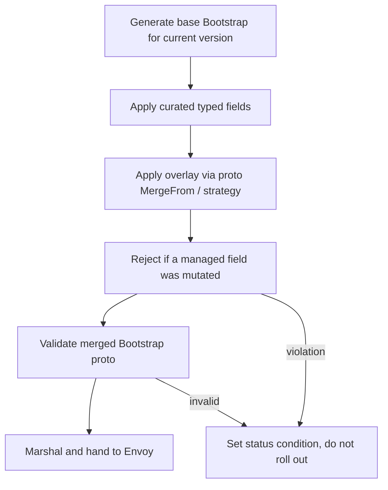

# EP-13666: Mutable Envoy bootstrap config for managed gateway proxies

- Issue: [#13666](https://github.com/kgateway-dev/kgateway/issues/13666)

## Background

For a managed gateway proxy, kgateway's deployer generates the Envoy bootstrap
(`envoy.yaml`) from an internal Helm template, stores it in a `ConfigMap` named
after the `Gateway`, and mounts it into the proxy `Pod` at `/etc/envoy` via a
volume named `envoy-config`. The `envoy-wrapper` (envoyinit) reads that file and
feeds it to Envoy as the whole bootstrap.

`GatewayParameters.spec.kube.envoyContainer.bootstrap` exposes only a handful of
curated knobs today (`logLevel`, `componentLogLevels`, `logFormat`,
`dnsResolver.udpMaxQueries`, `enableReadinessProbeProxyProtocol`). Anything else
in the bootstrap — **Envoy reloadable feature flags**
(`envoy.reloadable_features.*`), `stats_config.histogram_bucket_settings`
([#14088](https://github.com/kgateway-dev/kgateway/issues/14088)),
`stats_flush_interval`, extra runtime layers, alternate DNS resolver settings, custom
static clusters — is not reachable through the API.

The concrete motivating case (this issue, #13666) is reloadable feature flags. When
an Envoy upgrade changes behavior, Envoy ships a `envoy.reloadable_features.<name>`
flag so operators can roll the behavior back temporarily while they adapt; the flag
is later removed once the new behavior is settled. Those flags live in the bootstrap
(as a `layered_runtime` layer), so today a kgateway user has no supported way to set
one. The issue explicitly asks that this be solved **generically — a way to alter
the bootstrap, not a reloadable-feature-specific knob** — which is the shape this EP
takes.

The current answer is a workaround: copy the generated bootstrap into a custom
`ConfigMap`, add the desired config, and repoint the `envoy-config` volume at it
using a `deploymentOverlay` (`spec.kube.deploymentOverlay`). This works, but it
forces the user to own a **complete, verbatim copy** of the generated bootstrap,
including control-plane–managed fields (`node.cluster`, `node.metadata.role`, the
`xds_cluster`, the xDS JWT SDS config, `dynamic_resources`).

### Relevant sources

- Bootstrap template: `pkg/kgateway/helm/envoy/templates/configmap.yaml`
- Wrapper that loads, transforms, and re-marshals the bootstrap proto:
  `pkg/envoyinit/run.go` (already unmarshals into `envoy.config.bootstrap.v3.Bootstrap`,
  mutates it, and re-marshals)
- API types: `api/v1alpha1/kgateway/gateway_parameters_types.go` (`EnvoyBootstrap`)
- Overlay precedent (strategic merge patch with `$patch` directives):
  `api/v1alpha1/shared/overlay_types.go` (`KubernetesResourceOverlay`)

## Motivation

The workaround is fragile in exactly the way an API should not be. The moment
kgateway changes its bootstrap template in a future version — a new xDS field, a
new static listener, a renamed cluster, a new managed filter — the user's copied
`ConfigMap` silently drifts from the generated format. There is no merge, no
validation, and no warning; the user must manually re-reconcile their copy on every
upgrade, and a stale copy can break xDS connectivity or crash-loop the proxy.

We want a first-class way to mutate the bootstrap that:

1. lets the user express **only their delta**, not a full copy, and
2. **continues to apply correctly when the base bootstrap meaningfully changes**
   in a future version, because untouched fields flow through automatically.

## Goals

- Provide a `GatewayParameters` API to mutate the managed proxy's Envoy bootstrap
  without copying the whole document.
- Apply user mutations as a **structured patch against the Envoy `Bootstrap` proto,
  after the base bootstrap is generated**, so the base can evolve across versions
  without breaking user config.
- Satisfy [#14088](https://github.com/kgateway-dev/kgateway/issues/14088)
  (`stats_config.histogram_bucket_settings`) with a curated, validated field.
- Protect control-plane–managed bootstrap fields from being mutated, so a
  user's stale patch can never break xDS connectivity after an upgrade.
- Validate the merged bootstrap before rollout and report results on status, rather
  than crash-looping Envoy.

## Non-Goals

- Replacing the existing `deploymentOverlay` mechanism. It remains the escape hatch
  for `Deployment`-level changes (volumes, sidecars, etc.); this EP is specifically
  about bootstrap *content*.
- Mutating dynamic (xDS-delivered) config such as listeners, routes, and clusters.
  Those are owned by the translation pipeline and configured via Gateway API and
  policy CRDs.
- Letting users override control-plane–managed bootstrap fields (the xDS cluster,
  node identity, ADS config, SDS token). These are explicitly denied.
- Arbitrary text/templating of the bootstrap document (see Alternatives).

## Implementation Details

### Design principle

Apply mutations as a **proto-level patch onto the freshly generated `Bootstrap`,
on every translation** — never as a textual or whole-document replacement. This is
the same layering Envoy itself uses (`--config-path` + `--config-yaml`, which is a
proto `MergeFrom`) and the same place the envoyinit wrapper already
unmarshals / mutates / re-marshals the bootstrap. Because the patch targets stable
proto field paths rather than line/character positions, it keeps working when the
surrounding base config changes.



### Configuration

Extend `EnvoyBootstrap` in `api/v1alpha1/kgateway/gateway_parameters_types.go` with
a `patches` field, structured in two layers.

```yaml
apiVersion: gateway.kgateway.dev/v1alpha1
kind: GatewayParameters
metadata:
  name: my-gateway
spec:
  kube:
    envoyContainer:
      bootstrap:
        patches:
          # Layer 1: curated, strongly-typed fields for common cases.
          statsConfig:
            histogramBucketSettings:
              - match: { prefix: "cluster." }
                buckets: [1, 5, 10, 25, 50, 100, 250, 500, 1000, 2500, 5000, 10000]
            # statsFlushInterval, etc. promoted here as demand warrants.

          # Layer 2: typed proto-merge escape hatch for everything else.
          overlay:
            mergeStrategy: StructuredMerge   # default; proto MergeFrom semantics
            value:                           # a partial envoy.config.bootstrap.v3.Bootstrap
              stats_flush_interval: 10s
              # Toggle an Envoy reloadable feature flag. These are plain runtime
              # keys, so they are expressed as a layered_runtime static_layer —
              # there is no dedicated "reloadable feature" field in the bootstrap
              # schema.
              layered_runtime:
                layers:
                  - name: user_runtime
                    static_layer:
                      envoy.reloadable_features.no_extension_lookup_by_name: false
```

#### Worked example: reloadable feature flags

Toggling an Envoy reloadable feature is the most common near-term ask, so it is worth
making explicit. There is **no flat "reloadable features" field** in the Envoy
bootstrap — a feature flag like `envoy.reloadable_features.<name>` is just a runtime
key, set through `layered_runtime.layers[].static_layer` as shown above.

This interacts with the merge semantics in a way that must be understood:

- The generated base bootstrap **already defines** a `layered_runtime` with two
  layers — `static_layer` (holding e.g.
  `envoy.restart_features.use_eds_cache_for_ads: true`) and `admin_layer`
  (`pkg/kgateway/helm/envoy/templates/configmap.yaml`).
- Under the default `StructuredMerge` (proto `MergeFrom`), the user's `layers` entry
  is **appended** to the base list, not merged into the existing `static_layer`.
  Envoy evaluates layers in order with later layers winning, so an appended user
  layer correctly overrides earlier values — this is the desired behavior.
- Therefore: give the user layer a **distinct `name`** (e.g. `user_runtime`). Reusing
  `static_layer` appends a second layer of the same name rather than editing the
  managed one, which is confusing and unnecessary. A user who genuinely needs to
  replace the managed runtime wholesale uses `mergeStrategy: Replace` on
  `layered_runtime` instead — and the denylist must *not* cover `layered_runtime`, so
  this path stays open.

Two layers, deliberately:

1. **Curated typed fields** (`statsConfig.histogramBucketSettings`,
   `statsFlushInterval`, `dnsResolver`, ...). These give CRD validation,
   documentation, and a stable contract. Issue #14088 is satisfied here directly —
   no escape hatch needed for the common ask. As new demand appears, a field is
   promoted from the overlay into this curated set.

2. **A typed proto overlay** (`overlay.value`), validated as a *partial*
   `envoy.config.bootstrap.v3.Bootstrap` via
   `+kubebuilder:pruning:PreserveUnknownFields` plus an admission-time proto
   validation step. The user supplies only the sub-message they care about; kgateway
   merges it onto the generated `Bootstrap`. Because it is keyed by proto field, it
   survives base-template changes; because it is validated against the real
   `Bootstrap` schema, typos and bad types are rejected at admit time rather than
   crash-looping Envoy.

#### Phasing

The two layers do not need to land together, and shouldn't. Layer 2 (the overlay) is
strictly more general than Layer 1 (curated fields): anything a curated field does,
the overlay can already express. So we ship the overlay first and curate later, as
demand proves which fields deserve a first-class contract. This resolves the "where
to curate" open question in favor of **start generic, curate on evidence**.

- **Phase 1 — overlay + guardrails (the MVP).** `bootstrap.patches.overlay` with
  `StructuredMerge`, the managed-field denylist, merged-result proto validation, and
  status reporting. This alone satisfies the headline asks: reloadable feature flags
  (worked example above), `stats_flush_interval`, extra runtime layers, and
  `stats_config.histogram_bucket_settings` ([#14088](https://github.com/kgateway-dev/kgateway/issues/14088))
  — all expressible as a partial `Bootstrap`. No curated field is required to be
  *useful*; the guardrails are what make it *safe*, and they are non-negotiable for
  Phase 1.
- **Phase 2 — promote curated fields on evidence.** When a given overlay shape
  recurs (starting with `statsConfig.histogramBucketSettings` for #14088), promote it
  into a strongly-typed Layer 1 field for CRD validation, documentation, and a stable
  contract. Promotion is backward-compatible: the curated field and the overlay
  target the same proto path, with the curated field applied first and the overlay
  layered on top.
- **Phase 3 — removal/replace strategies.** Add `Replace` and (discouraged)
  `JSONPatch` once a concrete need for non-additive edits appears. `StructuredMerge`
  covers the additive majority, so this is deferred rather than built speculatively.

#### Merge semantics

Proto `MergeFrom` is additive: repeated fields append, singular fields overwrite,
messages merge recursively. It cannot *remove* or wholesale-*replace* a repeated
field, which users eventually need. We model `mergeStrategy` on the *vocabulary* of
the existing `KubernetesResourceOverlay` (`api/v1alpha1/shared/overlay_types.go`),
but note this is a **conceptual** borrow, not a code reuse. That overlay is
implemented with Kubernetes strategic merge patch
(`pkg/deployer/strategicpatch/strategicpatch.go`, via
`k8s.io/apimachinery/pkg/util/strategicpatch`), which depends on
`patchStrategy`/`patchMergeKey` struct tags on the target k8s API types and a typed
`dataObj` passed to `StrategicMergePatch`. The Envoy `Bootstrap` proto carries none
of that metadata, so the existing machinery cannot be pointed at the bootstrap; the
strategies below are a fresh implementation over proto/JSON. Expose a per-overlay
`mergeStrategy`:

- `StructuredMerge` (default) — proto `MergeFrom`; additive and safe.
- `Replace` — replace a named sub-message/list wholesale (e.g. fully define
  `stats_config`), using `$patch: replace` semantics.
- `JSONPatch` — RFC 6902 ops against the bootstrap, for surgical removals. This is
  the one mode whose paths re-couple to base structure, so it is discouraged and
  documented as such.

### Controllers

The merge is performed by the deployer/translation path that already produces the
bootstrap. Concretely, two viable insertion points; this EP recommends the first:

1. **In the controller, before writing the bootstrap `ConfigMap`.** Today the
   deployer does *not* build a `Bootstrap` proto here — it renders the bootstrap as
   Helm text (`pkg/kgateway/helm/envoy/templates/configmap.yaml`). So this option
   introduces a new step that does not exist today: parse the Helm-rendered
   `envoy.yaml` into an `envoy.config.bootstrap.v3.Bootstrap`, apply curated fields,
   apply the overlay, validate, then re-marshal back to `envoy.yaml`. The
   unmarshal/mutate/re-marshal roundtrip is already proven safe in the envoyinit
   wrapper (`pkg/envoyinit/run.go`), so this is mechanically sound — but it is new
   integration, not a reuse of an existing proto build. (The existing
   `pkg/xds/bootstrap` `ConfigBuilder` is *not* a drop-in base generator: it
   synthesizes a bootstrap purely to validate translated xDS, and is not the
   managed-proxy bootstrap.) This keeps all logic and status reporting in one place
   and means the `ConfigMap` on the cluster is already the final config.

2. **In the envoyinit wrapper** (`pkg/envoyinit/run.go`), which already round-trips
   the bootstrap proto. The patch could be delivered as an env var / mounted file and
   merged there. This is closer to Envoy's own `--config-yaml` model but moves
   validation off the control plane and out of status reporting, so it is not
   preferred.

#### Guardrails (the load-bearing part)

- **Reject mutation of control-plane–managed fields.** Maintain a denylist of proto
  paths the control plane owns: `node`, `dynamic_resources.ads_config`, the
  `xds_cluster` static cluster, the admin address, and the xDS JWT SDS cluster (all
  confirmed present in the generated bootstrap,
  `pkg/kgateway/helm/envoy/templates/configmap.yaml`). A patch touching any of these
  is rejected with a clear status condition. This is the property that stops a stale
  user patch from breaking xDS after an upgrade.

  Note this is a **new, enforced** guardrail with no existing enforcement precedent.
  The closest analogue, `ExtraArgs`, only *documents* that `--service-node`,
  `--log-level`, `--component-log-level`, and `--disable-hot-restart` "must not be
  set here" (a doc comment on the field, `gateway_parameters_types.go`); nothing in
  code rejects them, and that same comment points users to `DeploymentOverlay` to
  override those values if desired. So the existing project posture is
  *document-and-allow-override-via-escape-hatch*, not enforce. Choosing enforcement
  here is a deliberate departure justified by the upgrade-safety goal, not an
  extension of precedent — see Open Questions on denylist strictness.
- **Validate the merged result, not just the patch.** Run the combined `Bootstrap`
  through Envoy's proto validation before rollout. A reusable validator already
  exists — `pkg/validator` (binary/docker/caching, running `envoy --mode validate`
  over an `envoy.config.bootstrap.v3.Bootstrap`) — but today it is wired only into
  the **translator** to validate dynamic xDS (`proxy_syncer.go` →
  `NewCombinedTranslator(..., validator)`), not the deployer's static bootstrap, and
  the envoyinit wrapper does **not** itself validate (it only roundtrips the proto).
  Reusing this validator on the bootstrap path is therefore new wiring. Caveat: the
  docker-based validator depends on pulling/running an Envoy image, which is fragile
  in network-restricted CI/dev environments; prefer the binary validator where the
  Envoy binary is available. Surface failures on status rather than rolling out a
  crash-looping proxy.

### Deployer

- The bootstrap `ConfigMap` rendering gains the merge step described above.
- No new volumes or mounts are required; the existing `envoy-config` volume continues
  to carry the (now merged) bootstrap.
- A change to `bootstrap.patches` triggers the same reconcile/rollout the deployer
  already performs for other `GatewayParameters` changes.

### Translator and Proxy Syncer

No changes to xDS translation. This EP only affects the static bootstrap; dynamic
resources continue to be delivered by the existing translation pipeline.

### Reporting

Add a status condition on the `Gateway` / `GatewayParameters` reflecting bootstrap
patch application: `Applied`, or `Rejected` with a reason (managed-field violation,
proto validation failure, unknown field). This makes an invalid or drifting overlay
visible without reading Envoy logs.

### Test Plan

- **Unit:** merge logic per `mergeStrategy`; denylist enforcement for each managed
  path; partial-`Bootstrap` proto validation (valid, unknown-field, wrong-type);
  curated `histogramBucketSettings` rendering.
- **Translator/golden:** `GatewayParameters` inputs with curated fields and overlays
  produce the expected merged bootstrap; a base-bootstrap change does not disturb the
  user delta (regression guard for the core "survives version change" goal).
- **e2e:** apply `bootstrap.patches.statsConfig.histogramBucketSettings`, then assert
  the running Envoy reports the custom buckets via the admin `/config_dump`
  `BootstrapConfigDump`. This is a **new** e2e suite: there is no existing
  `BootstrapConfigDump`/`/config_dump` assertion in the test tree, and no
  `CustomEnvoyBootstrap` suite exists. The nearest existing artifact is a deployer
  Helm golden-test fixture (`envoy-configs-and-overlays` in
  `test/deployer/internal_helm_test.go`), which validates rendered output but does
  not exercise a running proxy. Add a negative e2e for a denied managed-field patch
  surfacing a `Rejected` status.

## Alternatives

- **Status quo: clone `ConfigMap` + `deploymentOverlay`.** Works today but requires a
  verbatim full copy of the generated bootstrap and silently drifts on upgrade. This
  EP's whole motivation is to remove that fragility. The mechanism stays available for
  `Deployment`-level needs.
- **`--config-yaml` via `envoyContainer.extraArgs`.** Envoy's overlay flag is the
  right idea, but the envoyinit wrapper already invokes Envoy with one
  `--config-yaml <generated bootstrap>`; a second `--config-yaml` from `extraArgs`
  collides (the flag is single-valued and errors when repeated). A controlled,
  in-process proto merge avoids this entirely.
- **A single opaque "full bootstrap replacement" field.** Rejected: it reintroduces
  the verbatim-copy problem and the managed-field hazard, just inside the CRD instead
  of a `ConfigMap`.
- **String templating of the bootstrap.** Rejected: text-level patches re-couple to
  line/character structure and break on base changes — exactly what we are trying to
  avoid.

## Open Questions

- **Enforce vs. document.** Should managed fields be *enforced* (reject the patch,
  set `Rejected` status) or merely *documented* as unsupported, mirroring the
  existing `ExtraArgs` posture (doc comment + "use `DeploymentOverlay` to override")?
  Enforcement is what delivers the upgrade-safety goal, but it diverges from the
  project's current document-and-allow-override convention and removes an escape
  hatch power users currently rely on. This EP recommends enforcement for the
  control-plane-owned xDS/identity paths specifically (where a stale override is
  catastrophic), and leaning toward documentation for merely-discouraged paths.
- **Denylist vs. allowlist.** If we enforce, is a curated denylist of managed proto
  paths sufficient, or should the overlay be restricted to an allowlist of known-safe
  top-level fields (`stats_config`, `layered_runtime`, `stats_flush_interval`,
  `typed_dns_resolver_config`, additional `static_resources.clusters`)? An allowlist
  is safer but less flexible.
- **Where to validate.** Admission webhook vs. controller-time validation with status
  reporting. Webhook gives immediate feedback but adds a moving part; controller-time
  fits the existing status model.
- **Custom static clusters.** *Resolved by Phasing:* #13666 calls out "custom
  options in the bootstrap config" generally; user-defined static clusters (e.g. an
  `aws_sts_cluster` for an external integration) are a representative example. These
  go through the Layer 2 overlay in Phase 1 (appended to `static_resources.clusters`
  via `StructuredMerge`), and are promoted to a curated `staticResources.clusters`
  field in Phase 2 only if demand warrants — at which point curation can add conflict
  detection against managed cluster names (`xds_cluster`, the local cluster). The one
  open sub-question is whether Phase 1 should additionally *reject* a user cluster
  whose name collides with a managed one, or merely document the hazard; given the
  denylist already protects the managed `xds_cluster` definition itself, a name
  collision is a footgun rather than an xDS-breaking event, so documentation is
  likely sufficient until Phase 2.
