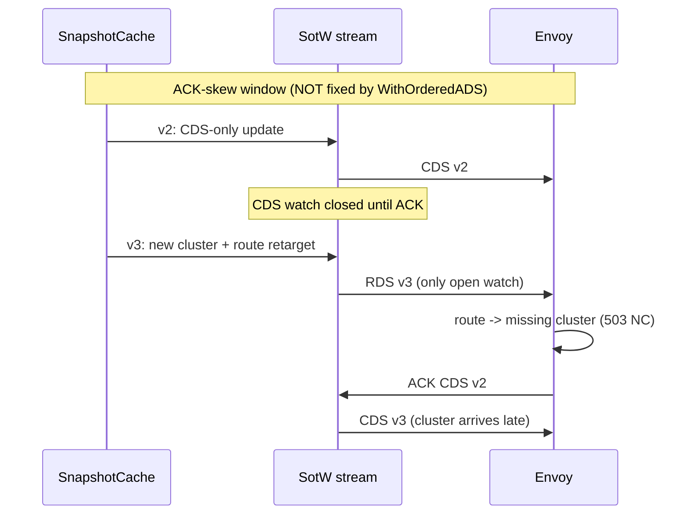

# EP-NNNN: Ordered ADS Response Delivery

- Issue: TBD (rename this file to `NNNN-ordered-ads-adoption.md` once the issue is filed)
- Audience: this is written to be implemented directly; each phase ends with acceptance criteria.

Related:

- EP [#13586 referenced-only cluster discovery](https://github.com/kgateway-dev/kgateway/pull/14341) - its reference-ahead and de-reference grace windows are the complement to this proposal; together they cover all three delivery windows described below.

## 1. Summary

`sotwv3.WithOrderedADS()` is a one-line go-control-plane server option that makes ADS responses reach each Envoy in the snapshot cache's type order (CDS, EDS, LDS, RDS) instead of an order randomized under load. kgateway runs the default (unordered) server today. This EP adopts the option behind a default-off setting (`KGW_ENABLE_ORDERED_ADS`), adds delivery-order tests that pin what the option does and does not fix, soaks it in one e2e/conformance CI leg, then flips the default.

Read section 2 before writing any code: the option closes exactly one of three delivery-ordering windows, and the tests you write in Phase 0 must demonstrate all three, so that nobody later mistakes this change for a full fix.

## 2. Background

### 2.1 How responses are ordered today

kgateway builds its control plane in `NewControlPlane` (`pkg/kgateway/setup/controlplane.go`):

```go
snapshotCache := envoycache.NewSnapshotCache(true, xds.NewNodeRoleHasher(), envoyLoggerAdapter)
xdsServer := xdsserver.NewServer(ctx, snapshotCache, allCallbacks)
```

Two layers decide the order in which an Envoy sees responses:

1. The cache. With `ads=true` (the first argument above), `SetSnapshot` answers open watches in a fixed type order: Cluster, Endpoint, Listener, Route. That ordering was chosen deliberately for make-before-break on additions (go-control-plane issue [#526](https://github.com/envoyproxy/go-control-plane/issues/526)). So the writes into the stream's per-type watch channels are already ordered.
2. The stream drain. The default SotW server gives each resource type its own watch channel and drains them with `reflect.Select`, which picks randomly among channels that are ready at the same moment. On a quiet stream (one response in flight at a time) the cache's write order survives. On a busy stream (several types ready at once) the wire order is randomized.

`WithOrderedADS()` (`pkg/server/sotw/v3/server.go` in go-control-plane) replaces the per-type channels with one multiplexed, buffered channel (`pkg/server/sotw/v3/ads.go`, `processADS`), so responses hit the wire in exactly the order the cache produced them. It affects ADS streams only. kgateway proxies use ADS exclusively (`ads_config` in the Envoy bootstrap ConfigMap), so the individually-registered per-type discovery services in `controlplane.go` are dormant surface for our own proxies.

### 2.2 The three delivery windows

There are three distinct ways a route can reach Envoy before or after the cluster state it depends on. Only the first is fixed by this EP:

| Window | Default server | With `WithOrderedADS()` | Fixed by |
|---|---|---|---|
| Busy-stream addition: several types ready at once, e.g. one snapshot bumps CDS and RDS | randomized; the route can hit the wire before its cluster | ordered, CDS first | this EP |
| ACK skew: a new snapshot lands while a prior CDS response is still un-ACKed | RDS ships before CDS, deterministically | same | reference-ahead grace (EP #13586) |
| Combined removal: one snapshot drops a cluster and de-references it from routes | CDS removal tends to precede the RDS de-reference | same, now deterministically | de-reference grace (EP #13586) |

The ACK-skew window deserves the diagram, because it is the one people assume ordered ADS fixes and it does not: SotW can only answer *open* watches, and a pending ACK holds that type's watch closed.



### 2.3 Why busy streams are common here

Per-client snapshots are recomputed in one sweep, so a single input change routinely bumps several type versions in one `SetSnapshot` (CDS+EDS on any backend change; LDS+RDS on route or listener changes). Controller start is the worst case: every connected Envoy reopens all four watches at once and the first snapshot answers all of them in a single call. The several-types-ready condition is the norm there, not the exception.

## 3. Motivation

A route that reaches the wire before the CDS carrying its cluster produces transient `503` with `NC` (no cluster) response flags on a perfectly valid configuration. The busy-stream window makes these rare and nondeterministic - the worst combination: unreproducible CI flakes and unexplained blips in production captures. Adopting the option:

- closes the busy-stream addition window entirely: any route and cluster in the same snapshot arrive cluster-first;
- makes wire order deterministic, so remaining delivery-order incidents are attributable to the two windows that are actually left (which is what makes EP #13586's graces individually measurable);
- has a tiny blast radius: one option at server construction, no API/CRD change, no proxy-side change, revertible by env var.

## 4. Goals

- Deliver ADS responses in the cache's type order; eliminate busy-stream reordering on additions.
- Ship opt-in first (`KGW_ENABLE_ORDERED_ADS`), then default-on with an escape hatch.
- Pin both server modes with delivery-order tests so the difference stays load-bearing in CI.

## 5. Non-Goals

- Closing the ACK-skew window (needs reference-ahead grace, EP #13586).
- Closing the removal window (needs de-reference grace, EP #13586).
- Delta xDS migration (eliminates the ACK-skew class outright; separate EP-scale effort).
- Any change to snapshot computation, per-client fan-out, or publication semantics.

## 6. Implementation

### 6.1 Phase 0a: setting and wiring

1. Add to the `Settings` struct in `api/settings/settings.go`, following the existing bool conventions (`EnableIstioIntegration` etc.):

```go
// EnableOrderedAds delivers ADS responses to each Envoy strictly in the
// snapshot cache's type order (CDS, EDS, LDS, RDS) instead of the default
// randomized drain, closing the busy-stream reordering window on additions.
// It does not change ACK-skew or removal ordering. See
// design/ordered-ads-adoption.md.
EnableOrderedAds bool `split_words:"true"`
```

envconfig derives `KGW_ENABLE_ORDERED_ADS`. No helm change is needed for opt-in: `controller.extraEnv` already passes arbitrary env vars through (`install/helm/kgateway/templates/deployment.yaml`).

2. Thread it into the control plane. `NewControlPlane` is called once, from `pkg/kgateway/setup/setup.go` (search for `NewControlPlane(`). Add an `orderedADS bool` parameter and pass `s.globalSettings.EnableOrderedAds`. In `controlplane.go`:

```go
import (
    sotwv3 "github.com/envoyproxy/go-control-plane/pkg/server/sotw/v3"
    serverconfig "github.com/envoyproxy/go-control-plane/pkg/server/config"
)

var xdsOpts []serverconfig.XDSOption
if orderedADS {
    xdsOpts = append(xdsOpts, sotwv3.WithOrderedADS())
}
xdsServer := xdsserver.NewServer(ctx, snapshotCache, allCallbacks, xdsOpts...)
```

`server.NewServer` forwards options to both the SotW and delta servers; kgateway serves no delta clients, so the delta side is dormant.

3. Update `api/settings/settings_test.go`: the all-env-vars case gains `"KGW_ENABLE_ORDERED_ADS": "true"`, and the defaults baseline pins `false`.

Acceptance: `make analyze` clean; settings tests pass; a local run with and without the env var starts and serves xDS (any e2e suite passing under both values is sufficient).

### 6.2 Phase 0b: delivery-order tests (new; these do not exist yet)

Create `pkg/kgateway/setup/ads_delivery_order_test.go`. These tests run the real go-control-plane server (`server.NewServer` + `envoycache.NewSnapshotCache(true, ...)`) against a hand-rolled mock ADS stream, in both modes, and pin each row of the table in section 2.2. They are the regression net that keeps the two unfixed windows visibly unfixed.

Harness sketch:

```go
// mockAdsStream implements discoveryv3.AggregatedDiscoveryService_StreamAggregatedResourcesServer.
// grpc.ServerStream methods can be stubbed via an embedded struct; only
// Context, Send, and Recv matter.
type mockAdsStream struct {
    grpc.ServerStream
    ctx  context.Context
    sent chan *discoveryv3.DiscoveryResponse // Send pushes here; buffered (>= 8)
    recv chan *discoveryv3.DiscoveryRequest  // Recv pops from here
}
```

- Run `srv.StreamAggregatedResources(stream)` in a goroutine; feed requests via `recv`; observe wire order via `sent`.
- Drive the protocol manually: an initial request per type URL (empty version, empty nonce) opens that type's watch; an ACK is a request repeating the type URL with the received `version_info` and `response_nonce`. Write small helpers `subscribe(typeURL)` and `ack(resp)`.
- Every channel read needs a timeout (`select` with `time.After`); a hung test here means a protocol-state mistake in the test, not a server bug - fix the test.
- Parameterize every test over `ordered bool` and construct the server with or without `sotwv3.WithOrderedADS()` accordingly.

The three scenarios:

1. Quiet-stream addition (both modes, deterministic). Subscribe to all four types, ACK everything after each response, then `SetSnapshot` with a snapshot that adds a cluster and a route referencing it. Assert the CDS response is received before the RDS response in both modes: on a quiet stream, the cache's write order survives even the default drain, because only one response is in flight at a time when the test ACKs serially. This pins the baseline.
2. ACK skew (both modes, deterministic, expected "failure" shape). Subscribe to all types and ACK the initial responses. Publish v2 with a CDS-only change; receive CDS v2; do not ACK it. Publish v3 that adds a cluster and retargets a route onto it. Assert RDS v3 arrives while CDS v2 is still un-ACKed - in both modes. Then ACK CDS v2 and assert CDS v3 arrives. Name the test so the point is unmissable, e.g. `TestADSAckSkewDeliversRouteBeforeClusterEvenWhenOrdered`.
3. Combined removal (ordered mode, deterministic). Publish a snapshot that drops a cluster and removes the route that referenced it, with all watches open and ACKed. In ordered mode, assert the CDS (removal) response precedes the RDS (de-reference) response - i.e. ordered ADS makes the removal ordering deterministically wrong-way-around. In default mode the order is randomized; do not assert an order there (a nondeterministic assertion is a flake generator), just assert both responses arrive.

Note on the busy-stream addition window itself: its default-mode behavior is randomized by `reflect.Select`, so there is no deterministic assertion to write for it in default mode. It is covered indirectly: scenario 1 pins ordered mode CDS-first, and the mode parameterization proves the ordered path is actually engaged (scenario 3's deterministic removal order only holds under ordered ADS).

Acceptance: all scenarios green in both parameterizations; `go test -race` clean on the package.

### 6.3 Phase 1: CI soak (default still off)

- In `.github/workflows/e2e.yaml`, set `KGW_ENABLE_ORDERED_ADS=true` via `controller.extraEnv` on exactly one kind-cluster matrix entry - one that includes the `XdsWarming` suite, since it exercises the warming/make-before-break paths that delivery order can disturb.
- Run one Gateway API conformance leg with the flag on.
- What to watch during the soak: NACK reports in controller logs (`logNackCallback` in `pkg/kgateway/setup/envoy_error.go` already logs per-resource NACKs and their resolution); clusters stuck warming in `config_dump` during e2e; `XdsWarming` flakes; any growth in time-to-Ready for gateway pods.

Acceptance: two weeks / a handful of main merges with the soak leg green and no NACK or warming anomalies attributed to the flag.

### 6.4 Phase 2: default on

- Flip the struct default (`default:"true"`) and keep the env var as the escape hatch for at least two minor releases.
- Changelog: `/kind feature`, release note stating the new wire-order guarantee (responses within one snapshot arrive CDS, EDS, LDS, RDS) and the `KGW_ENABLE_ORDERED_ADS=false` escape hatch.
- Promote the soak leg's configuration to the default matrix; keep one leg running with the flag off until the escape hatch is retired, so both modes stay covered.

### 6.5 Phase 3: compose with EP #13586

When the reference-ahead and de-reference graces land, scenarios 2 and 3 in the delivery-order tests describe windows that the control plane no longer steps into (the graces split the risky combinations across snapshots). Update those tests then to assert the end-to-end property rather than the raw window. Do not weaken them before that.

## 7. Risks and pitfalls

- It fixes one window of three. The biggest risk is organizational: someone declares delivery ordering solved and deprioritizes the graces. This is why Phase 0b's scenario 2 and 3 tests assert the unfixed behavior by name - they are documentation with teeth. Do not skip them to save time; they are half the point of the EP.
- Less-traveled upstream path. `processADS` funnels all types through one buffered channel (capacity `types.UnknownType`) and its own comments concede a trade: per-type backpressure is gone, and an in-flight response for a type being re-subscribed can be dropped, on the theory that SotW's version handling re-answers from the new watch (the recreated watch carries the old version; the cache sees the mismatch and responds). That reasoning holds for our usage, but it is a different failure-recovery envelope than the per-type channels - hence the soak phase rather than a straight default flip.
- Ordered ADS makes the removal window deterministic too. Today a combined removal sometimes gets lucky under `reflect.Select`; afterwards the cluster removal always precedes the route de-reference. Not a regression of any guarantee (there was none), and determinism beats a coin flip for debugging, but removal-window incidents become 100% reproducible until the de-reference grace exists. Say this in the release note review if asked.
- Callback semantics are unchanged - `OnStreamRequest`/`OnStreamClosed` dispatch from the same single per-stream goroutine in both modes - so the unique-client identity bookkeeping (`pkg/krtcollections/uniqueclients.go`, including the per-request identity re-derivation from PR #14244) needs no changes. If you find yourself editing that file for this EP, stop and re-read the plan.

## 8. Alternatives

- Do nothing. Envoy's warming and last-good behavior make addition reordering a transient-503 nuisance rather than an outage, but this is the one delivery hole with a one-line, revertible fix.
- Control-plane graces only (EP #13586 without this). The graces split risky updates across snapshots, which sidesteps most same-snapshot reordering - but same-snapshot multi-type updates remain common (CDS+EDS churn), the graces are a much larger change, and the two compose. There is no reason to choose.
- Delta xDS. Eliminates the SotW ACK-skew class and shrinks payloads; a protocol migration with its own EP.

## 9. Open questions

- NACKs are currently logged (`logNackCallback`) but not counted. A `nack_total{type_url}` counter would make the Phase 1 soak assertable ("zero NACKs during conformance") instead of eyeballed. Small, separable; decide during Phase 0 review whether to fold it in.
- Should the escape hatch survive past two releases, or is test coverage of both modes enough to retire it on schedule?
