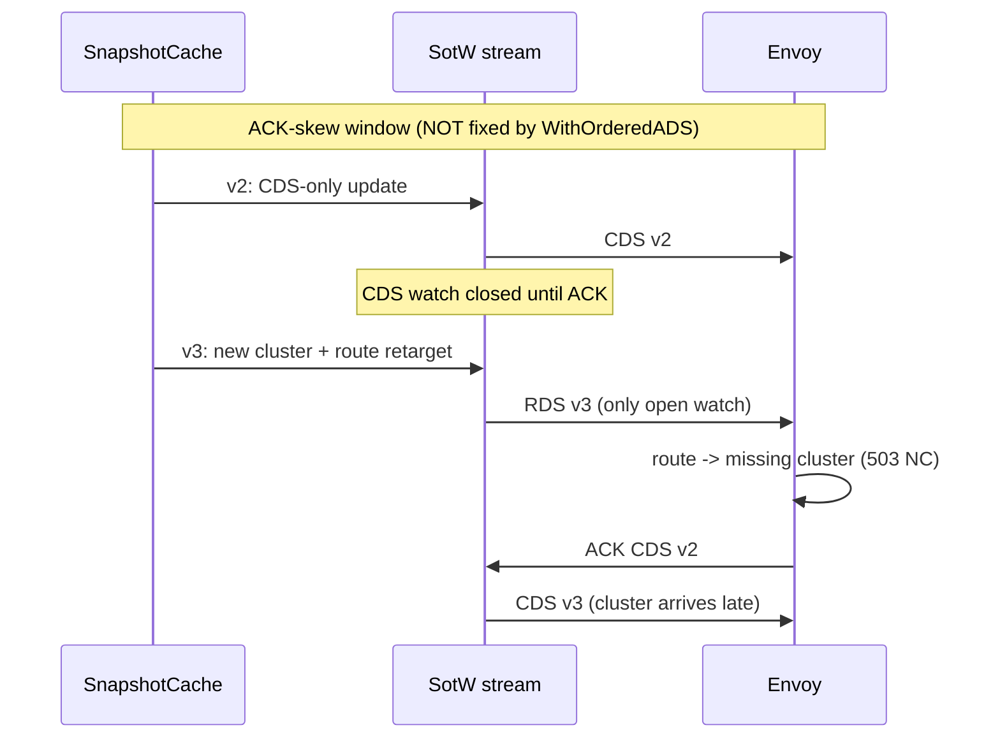

# EP-NNNN: Ordered ADS Response Delivery

- Issue: TBD (rename this file to `NNNN-ordered-ads-adoption.md` once the issue is filed)

Related:

- EP [#13586 referenced-only cluster discovery](https://github.com/kgateway-dev/kgateway/pull/14341) - evaluates ordered ADS as one of its building blocks; its reference-ahead and de-reference grace windows are the complement to this proposal.
- Delivery-order probes: `pkg/kgateway/proxy_syncer/xds_delivery_order_probe_test.go` (assumption GCP-A3, `devel/formal/lean/ASSUMPTIONS.md`).
- Model: `devel/formal/lean/XdsSpec/OrderedADS.lean`.

## Background

`sotwv3.WithOrderedADS()` is a one-line go-control-plane server option that switches ADS streams onto a strictly-ordered response path. kgateway runs the default (unordered) server today (`pkg/kgateway/setup/controlplane.go`). We have probe-level evidence of exactly what the option does and does not fix against the real server: it closes the busy-stream response-randomization window for additions, and it does nothing for the ACK-skew window or for removals.

This EP proposes adopting it behind a default-off setting (`KGW_ENABLE_ORDERED_ADS`), soaking it in an e2e/conformance CI leg, then flipping the default - while being explicit that it is a cheap partial fix, not the delivery-ordering endgame.

### What orders xDS responses today

kgateway constructs its control plane in `NewControlPlane` (`pkg/kgateway/setup/controlplane.go`):

```go
snapshotCache := envoycache.NewSnapshotCache(true, xds.NewNodeRoleHasher(), envoyLoggerAdapter)
xdsServer := xdsserver.NewServer(ctx, snapshotCache, allCallbacks)
```

Two layers decide the order in which Envoy sees responses:

1. The cache. With `ads=true` (which we pass), `SetSnapshot` answers open watches in a fixed type order: Cluster, Endpoint, Listener, Route (`pkg/cache/types/types.go` in go-control-plane; the ordering was chosen deliberately for make-before-break additions, see go-control-plane issue [#526](https://github.com/envoyproxy/go-control-plane/issues/526)). So the *writes* into the stream's per-type watch channels are already ordered.
2. The server stream drain. The default SotW path gives each resource type its own watch channel and drains them with `reflect.Select`, which picks *randomly* among channels that are ready at the same moment. On a quiet stream (one response in flight) the cache's write order survives; on a busy stream (several types ready at once) the wire order is randomized.

`WithOrderedADS()` replaces the per-type channels with one multiplexed, buffered channel (`pkg/server/sotw/v3/ads.go`) so responses reach the wire in exactly the order the cache produced them. It affects ADS streams only (`defaultTypeURL == AnyType`); kgateway proxies use ADS exclusively (`ads_config` in the Envoy bootstrap, `pkg/kgateway/helm/envoy/templates/configmap.yaml`), so the per-type discovery services registered in `controlplane.go` are effectively unused by our proxies.

### The three measured delivery windows

The probes in `xds_delivery_order_probe_test.go` run the real `server.StreamAggregatedResources` against a mock stream, in both modes:

| Window | Default server | WithOrderedADS | Fix |
|---|---|---|---|
| Busy-stream addition (several types ready at once) | randomized; route can hit the wire before its cluster | ordered, CDS first | **this EP** |
| ACK skew (snapshot lands while a prior CDS response is un-ACKed) | RDS before CDS, deterministically | same - SotW can only answer open watches, and the pending CDS ACK holds the CDS watch closed | reference-ahead grace (EP #13586) |
| Combined removal (drop cluster + de-reference route in one snapshot) | CDS removal first | same - the cache's fixed type order is *wrong* for removals, and ordered ADS cements it | de-reference grace (EP #13586) |



### Why busy streams are common in kgateway

Per-client snapshots are recomputed in a single KRT sweep, so one input change routinely bumps several type versions in one `SetSnapshot` (CDS+EDS on any backend change; LDS+RDS on route/listener changes). And controller start is the worst case: every connected Envoy reopens all four watches at once and the first snapshot answers all of them in one call - the multi-channel-ready condition is the norm there, not the exception. The busy-stream window is small but real for us, and it is the only addition-side window that pure server configuration can close.

## Motivation

Route updates that reach the wire before the CDS carrying their clusters produce transient `503 NC` on valid routes - user-visible errors with no configuration mistake anywhere. The busy-stream window makes these failures rare and nondeterministic, which is the worst combination for debugging: they surface as unreproducible flakes in CI and as unexplained blips in production packet captures.

Benefits of adopting `WithOrderedADS()`:

- Closes the busy-stream addition window. After this, every route reaching the wire is preceded by the CDS carrying its clusters whenever both are in the same snapshot. The transient 503-NC class from response reordering on additions is gone.
- Determinism. Response order becomes reproducible, which makes delivery-order bugs (and our probes) deterministic instead of rare flakes. Debugging a customer packet capture no longer needs a "the server may reorder" caveat.
- Tiny blast radius. One option at server construction; no API/CRD surface, no proxy-side change, trivially revertible via env var. The callback contract is identical in both paths - `OnStreamRequest`/`OnStreamClosed` dispatch from the same single per-stream goroutine (verified while pinning assumption GCP-A4), so the unique-client identity bookkeeping (`pkg/krtcollections/uniqueclients.go`, including PR #14244's per-request re-derivation) is unaffected.
- Regression safety already exists. The delivery-order probes are parameterized over `ordered bool` and pin the behavior of both modes; the GCP-A4 callback-serialization probes can be parameterized the same way. Flipping the default cannot silently change wire semantics without a probe telling us.
- Composes with EP #13586. Ordered delivery makes the EP's grace windows individually measurable: once the wire stops reordering additions, any remaining NC window is attributable to ACK skew or removal timing, which is exactly what the graces address.

## Goals

- Deliver ADS responses to each Envoy in the cache's type order (CDS, EDS, LDS, RDS), eliminating busy-stream reordering on additions.
- Ship it opt-in first (`KGW_ENABLE_ORDERED_ADS`), then default-on with an escape hatch.
- Keep both modes pinned by probes so the behavioral difference stays load-bearing in CI.

## Non-Goals

- Closing the ACK-skew window. SotW can only answer open watches; a pending CDS ACK holds CDS while an RDS retarget ships. This needs the reference-ahead grace from EP #13586.
- Closing the removal window. The cache's fixed type order ships cluster removals before route de-references in both modes. This needs the de-reference grace from EP #13586.
- Delta xDS migration (eliminates the ACK-skew class outright, but is a protocol migration deserving its own EP).
- Any change to snapshot computation, per-client fan-out, or the publication gates.

## Implementation Details

### Configuration

Add to `api/settings/settings.go`:

```go
// EnableOrderedAds delivers ADS responses to each Envoy strictly in the
// cache's type order (CDS, EDS, LDS, RDS) instead of the default
// randomized drain, closing the busy-stream reordering window on
// additions. See design/ordered-ads-adoption.md.
EnableOrderedAds bool `split_words:"true"`
```

envconfig maps this to `KGW_ENABLE_ORDERED_ADS`; `controller.extraEnv` in the helm chart already passes arbitrary env through (`install/helm/kgateway/templates/deployment.yaml`), so no chart change is needed for opt-in. When the default flips to `true` (Phase 2 below), the setting stays as the escape hatch.

### Controllers

Thread the setting from `pkg/kgateway/setup/setup.go` into `NewControlPlane` and construct the server conditionally:

```go
var xdsOpts []config.XDSOption
if globalSettings.EnableOrderedAds {
    xdsOpts = append(xdsOpts, sotwv3.WithOrderedADS())
}
xdsServer := xdsserver.NewServer(ctx, snapshotCache, allCallbacks, xdsOpts...)
```

No other component changes. Note that `server.NewServer` forwards the option to both the SotW and delta servers; kgateway serves no delta clients today, so the delta side is dormant surface.

### Rollout

- Phase 0 (plumbing, default off): the changes above, plus parameterizing the GCP-A4 callback-serialization probes over `ordered` the way the delivery probes already are.
- Phase 1 (CI soak): set `KGW_ENABLE_ORDERED_ADS=true` via `controller.extraEnv` on one kind cluster in `.github/workflows/e2e.yaml` - it should include the `xds_warming` suite, which exercises exactly the warming/make-before-break paths that delivery order can disturb. Run one Gateway API conformance leg with the flag on. Watch for: NACK storms in controller logs (`newLogNackCallback` already logs them), clusters stuck warming, `xds_warming` flakes, and growth in snapshot-to-ACK latency.
- Phase 2 (default on): flip the settings default; keep the env escape hatch for at least two minor releases; changelog `/kind feature` with a release note stating the wire-order guarantee and the escape hatch.
- Phase 3 (compose with EP #13586): the reference-ahead grace covers additions under ACK skew (the per-cluster held-flip resolution in `resolveDeferredPerCluster` already gives *unready* clusters this shape; ACK skew also affects ready clusters, which is what the EP's grace covers), and the de-reference grace covers removals. When each lands, update `devel/testing/formal-model-map.yaml` (`ordered-ADS-delivery-windows`) and rewrite the corresponding divergence pins to assert the closed window.

### Risks

- It fixes one window of three. The ACK-skew and removal windows persist by SotW design, deterministically, in both modes. The biggest risk of adopting this option is organizational, not technical: declaring the delivery-ordering problem solved. The formal-model-map entry (`ordered-ADS-delivery-windows`) must stay `divergent`, with its pins, until the grace windows land.
- Less-traveled upstream code path. `processADS` funnels all types through one buffered channel (capacity = `types.UnknownType`) and its own comment concedes the trade: no more per-type backpressure, and "potential for a dropped response from the cache" - an in-flight response for a type being re-subscribed is discarded on the theory that SotW's global version handling re-answers from the new watch. That analysis holds for our named-EDS-watch usage (assumption GCP-A1: the re-created watch carries the old version, the cache sees the mismatch and responds), but it is a different failure-recovery envelope than the per-type channels and deserves a soak, not just a reading.
- Fixed order is wrong for removals, and ordered ADS makes that deterministic too. Today a combined removal *sometimes* gets lucky under `reflect.Select`; with ordered ADS the cluster removal always precedes the route de-reference. This is not a regression of a guarantee (there was none), and determinism arguably beats a coin flip, but it does mean removal-window incidents become 100% reproducible until the de-reference grace exists.
- Upstream maturity. A search turned up no open ordered-ADS-specific bugs, but the ADS neighborhood has history (consistency checks, nonce lifecycle). The probes plus the CI soak are the mitigation.

### Test Plan

- Unit/probe: existing `TestADSAdditionOnQuietStreamIsClusterFirst`, `TestADSAckSkewDeliversRouteBeforeClusterEvenWithOrderedADS`, `TestADSOrderedServerStillDeliversClusterRemovalBeforeRouteUpdate` (both modes); GCP-A4 serialization probes parameterized over `ordered`.
- e2e: `xds_warming` suite and one conformance leg with `KGW_ENABLE_ORDERED_ADS=true` (Phase 1), promoted to the default matrix at Phase 2.
- Formal: `XdsSpec/OrderedADS.lean` already models both modes; the safe-addition system corresponds to ordered mode, and the ACK-skew and removal bug systems document what remains open after adoption.

## Alternatives

- Do nothing. The cache's `ads=true` write ordering plus Envoy's warming and last-good behavior already make addition reordering a transient-503 nuisance rather than an outage. But the busy-stream window is the one delivery hole with a one-line, revertible fix; the cost/benefit is hard to beat.
- Control-plane graces only (EP #13586 without ordered ADS). The graces split risky updates across snapshots, which sidesteps most same-snapshot reordering. But single-snapshot multi-type updates remain common (EDS+CDS churn), the graces are a substantially larger change, and the two compose - there is no reason to choose.
- Migrate to delta xDS. Eliminates the SotW ACK-skew class outright and shrinks payloads, but is a protocol migration with its own EP-scale design (subscription bookkeeping, cache swap, Envoy config), orthogonal to this option.

## Open Questions

- Is a metrics hook worth adding? `processADS` exposes no counters; if the soak surfaces anything, a lightweight response-order histogram would have to live in a `Send`-wrapping callback.
- Should the escape hatch survive past two releases, or is the probe coverage enough to retire it on schedule?
