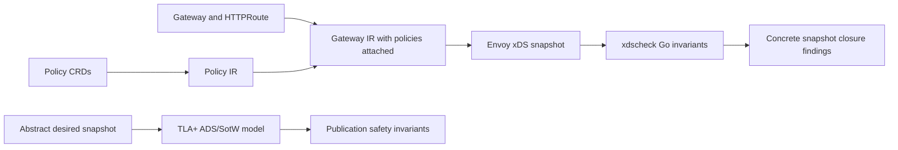

# Formal methods MVP for xDS correctness

## Motivation

This directory is an MVP for applying formal methods to kgateway's xDS correctness story. It does not claim that Envoy or kgateway is formally verified. Instead, it establishes a concrete, runnable verification seam that future IR -> xDS work can use:

- TLA+ / TLC models check abstract ADS/SotW publication, the issue-13868 reconnect readiness gate, the combined 13868/14184 per-client publication behavior, the end-to-end per-client convergence path, Envoy startup/warming ordering, issue-focused EDS subset invariants, and go-control-plane named EDS watch respondability.
- A Go validator checks concrete Envoy LDS/RDS/CDS/EDS snapshot dependency invariants.
- Tests and scripts make the seam repeatable for future translator validation.

## Scope

### TLA+ model

The TLA+ model covers protocol and state-machine behavior at a small finite-model level:

- Per-resource-type versions for LDS, RDS, CDS, and EDS.
- Per-stream response nonces and reconnect behavior.
- ACK, NACK, and stale nonce handling.
- Dependency-closed publication sequencing across listener, route, cluster, and endpoint resources.

The `XdsEdsSubset` model isolates an ADS named-EDS behavior relevant to issue 14184: if CDS stops advertising an EDS cluster while the EDS snapshot still contains that cluster's `ClusterLoadAssignment`, go-control-plane ADS mode can refuse to answer the EDS request because the snapshot contains resources outside Envoy's requested names.

The `XdsNamedEdsWatch` model focuses on the go-control-plane cache decision point behind that refusal. It checks that version-new EDS snapshots are compatible with Envoy's named EDS request and that EDS resource set changes are accompanied by an EDS version change.

The `XdsReconnectRace13868` model isolates the reconnect-time partial snapshot race fixed by PR 13868. It proves, in a finite model, that the readiness gate prevents the xDS cache from being overwritten by a snapshot whose route/listener cluster references are missing from CDS unless the missing cluster is explicitly errored. The companion buggy config demonstrates the old partial-publish counterexample.

The `XdsPerClientPublication` model combines the 13868 and 14184 failure shapes. It checks that retained last-good snapshots, referenced-cluster readiness, referenced-endpoint readiness, EDS filtering, named EDS response behavior, and a minimal Envoy warming/active distinction work together for the two critical traces.

The `XdsPerClientConvergence` model is the highest-leverage bridge across issue 13868, issue 14184, and startup/warming. It checks the full abstract path from last-good cache retention through partial input deferral, coherent input publication, named EDS response, EDS version change, and Envoy active-state closure.

The `XdsEnvoyWarming` model isolates startup and make-before-break ordering. It checks that CDS ACK is not treated as cluster-active before EDS, an empty `ClusterLoadAssignment` is not treated as ready, routes do not become active before referenced clusters are active, listeners do not become active before RDS, and old active clusters are not removed before traffic has moved away.

### Go validator

The Go package at `pkg/kgateway/translator/xdscheck` checks concrete Envoy xDS snapshots:

- Resource names are unique within each type.
- LDS HTTP connection manager RDS references resolve to emitted route configurations.
- Inline HCM route configurations are checked recursively.
- Route cluster and weighted cluster references resolve to emitted clusters.
- OAuth2 token endpoint, injected OAuth2 credential token endpoint, JWT AuthN remote JWKS, ExtAuthz, ExtProc, and global RateLimit service cluster references resolve to emitted clusters.
- ExtProc references nested under Envoy `ExtensionWithMatcher` composite actions are checked when the delegated filter is statically typed.
- ExtProc per-route override service cluster references in route `typed_per_filter_config` maps resolve to emitted clusters.
- HTTP gRPC, TCP gRPC, and OpenTelemetry access log service cluster references resolve to emitted clusters.
- Recognized tracing provider service cluster references resolve to emitted clusters.
- EDS clusters resolve to emitted ClusterLoadAssignments by `service_name`, or by cluster name when `service_name` is empty.
- Emitted ClusterLoadAssignments correspond to emitted EDS clusters; orphan endpoint resources are reported because they can poison ADS named EDS responses.
- Basic SDS references from checked TLS transport sockets, OAuth2 HTTP filters, credential-injector injected credentials, and recognized generic-secret formatter configs resolve to emitted secrets.
- Unsupported dynamic constructs produce warning findings rather than panic.

### Future proof systems

Lean, Dafny, F*, and Coq compiler proofs are future work, not part of this MVP. A later proof effort can target a smaller semantic compiler from Gateway/Policy IR into an abstract xDS snapshot, then use this validator as a concrete check at the protobuf boundary.

## Non-goals

- No proof of Envoy internals.
- No proof of Kubernetes watch semantics.
- No proof of all Envoy proto validation annotations.
- No production behavior change.
- No verification of every Envoy proto field.
- No vendored TLA+ tools jar or downloaded binary.

## Architecture



## How to run

Run the Go validator tests:

```bash
go test ./pkg/kgateway/translator/xdscheck
```

Run the full formal MVP check script:

```bash
devel/formal/check.sh
```

Run the focused translator integration test:

```bash
go test ./pkg/kgateway/translator/gateway -run '^(TestTranslatedRedirectSnapshotPassesXDSCheck|TestTranslatedBackendSnapshotPassesXDSCheck|TestTranslatedOAuth2SnapshotPassesXDSCheck|TestTranslatedExtAuthSnapshotPassesXDSCheck|TestTranslatedRateLimitSnapshotPassesXDSCheck|TestTranslatedExtProcSnapshotPassesXDSCheck|TestTranslatedGRPCAccessLogSnapshotPassesXDSCheck|TestTranslatedOpenTelemetryAccessLogAndTracingSnapshotPassesXDSCheck)$'
```

Run TLC directly when a TLA+ tools jar is available:

```bash
TLA2TOOLS_JAR=/path/to/tla2tools.jar devel/formal/tla/check.sh
```

Run TLC through Docker when host Java or a local jar is not available:

```bash
devel/formal/tla/check-docker.sh
```

The TLA+ script also looks for:

- `devel/formal/tla/tla2tools.jar`
- `tools/tla2tools.jar`

It prints install instructions if the jar is missing and does not download or vendor the jar.
The Docker script downloads the jar into a temporary host cache and mounts it into a Java container.

## Expected output

The Go test command should end with output like:

```text
ok  	github.com/kgateway-dev/kgateway/v2/pkg/kgateway/translator/xdscheck
```

When the TLA+ jar is installed, `devel/formal/tla/check.sh` should run TLC against the passing TLA+ configs and report that the configured invariants hold. When the jar is not installed, `devel/formal/check.sh` runs the Go tests and skips TLC with explicit instructions.

## Definition of MVP correctness

- TLC checks the stated safety invariants in finite models of ADS/SotW publication.
- The TLA+ model is small enough to run locally and to produce counterexamples if safety guards such as dependency-closed send or matching nonce ACK handling are deliberately broken.
- Go tests cover valid and invalid xDS snapshots directly constructed from Envoy v3 protos.
- Warning findings are used for dynamic or unsupported constructs that cannot be verified statically by this MVP.

## Bug-hunt plan

The next formal-methods-driven bug hunts should focus on places where a static xDS snapshot can be valid but runtime publication ordering can still break traffic:

1. Weighted cluster delayed endpoints: change an active route from `100% old` to weighted `old + new` while `new` has no usable endpoints. The expected behavior is that old traffic stays stable until every weighted backend dependency is ready, then traffic can split across old and new.
2. Multi-host route isolation: add a new host whose backend is delayed while an existing host remains valid. The expected behavior is that the new host remains unrouted or deferred without poisoning the existing host.
3. EDS service-name changes: keep the logical backend similar while changing `EdsClusterConfig.ServiceName`. The expected behavior is no stale CLA retention, no missing-CLA publication, and no named EDS response suppression.
4. Endpoint set transitions from ready to empty: remove all endpoints after a route is active and document the intended steady-state outage semantics separately from startup warming semantics.
5. Two clients, one partial: keep one connected Envoy client fully coherent while another has delayed clusters or endpoints. The expected behavior is that per-client deferral does not poison the ready client's cache.
6. EDS version churn or reuse: change the filtered EDS resource set and verify versions change when names change, without unnecessary churn for equivalent resource sets.
7. Delayed RDS/listener startup: withhold route configuration closure and verify listener activation behavior when LDS/RDS ordering, not CDS/EDS ordering, is the suspected risk.

## Integration seam

The current checked-in integrations are:

- `TestTranslatedRedirectSnapshotPassesXDSCheck`, which runs an existing redirect-only HTTP Gateway fixture through the kgateway translator and checks the emitted LDS/RDS snapshot with `xdscheck`.
- `TestTranslatedBackendSnapshotPassesXDSCheck`, which runs an existing backend-producing HTTP Gateway fixture and checks emitted LDS/RDS/CDS/EDS resources with `xdscheck`.
- `TestTranslatedOAuth2SnapshotPassesXDSCheck`, which runs an existing OAuth2 policy fixture and checks emitted LDS/RDS/CDS/EDS/SDS resources, including OAuth2 HTTP filter secret references, OAuth2 token endpoint clusters, and JWT AuthN remote JWKS clusters.
- `TestTranslatedExtAuthSnapshotPassesXDSCheck`, which runs an existing ExtAuthz HTTP policy fixture and checks emitted LDS/RDS/CDS/EDS resources, including ExtAuthz service clusters.
- `TestTranslatedRateLimitSnapshotPassesXDSCheck`, which runs an existing global rate limit policy fixture and checks the emitted RateLimit service clusters.
- `TestTranslatedExtProcSnapshotPassesXDSCheck`, which runs an existing ExtProc policy fixture and checks service clusters nested inside Envoy composite matcher actions.
- `TestTranslatedGRPCAccessLogSnapshotPassesXDSCheck`, which runs an existing HTTP gRPC access log fixture and checks the emitted access log service cluster.
- `TestTranslatedOpenTelemetryAccessLogAndTracingSnapshotPassesXDSCheck`, which runs an existing OpenTelemetry fixture and checks the emitted OTel access log and tracing service clusters.

The checker currently covers standard downstream and upstream TLS transport socket secret references, Envoy OAuth2 HTTP filter token and HMAC secret references, generic and OAuth2 injected credential SDS references, generic-secret formatter SDS references in recognized FileAccessLog, OpenTelemetry access log, OpenTelemetry tracing, and Zipkin tracing configs, OAuth2 token endpoint clusters, injected OAuth2 credential token endpoint clusters, JWT AuthN remote JWKS clusters, ExtAuthz HTTP or Envoy gRPC service clusters, ExtProc Envoy gRPC service clusters, ExtProc per-route override service clusters, global RateLimit Envoy gRPC service clusters, access log service clusters for recognized gRPC and OpenTelemetry access loggers, and tracing service clusters for recognized OpenTelemetry, Datadog, Lightstep, SkyWalking, and Zipkin tracing providers. Existing HTTPS translator fixtures use inline certificate material, so TLS transport socket SDS coverage is exercised by focused `xdscheck` unit tests rather than a translator fixture.

The intended future translator-test seam is:

- Run kgateway IR -> xDS translation as existing tests already do.
- Convert the emitted listeners, routes, clusters, endpoints, and secrets into `xdscheck.Snapshot`.
- Call `xdscheck.CheckSnapshot`.
- Fail tests on error-severity findings.
- Allow warning-severity findings for dynamic or unverifiable constructs such as `cluster_header`.

This keeps the MVP non-invasive while making it straightforward to attach concrete xDS invariant checks after translation.

See `devel/formal/model-to-go-test-matrix.md` for the explicit mapping from each TLA+ model obligation to existing Go coverage, partial coverage, and remaining gaps.

## Files

- `devel/formal/README.md`: overview, scope, commands, integration seam, and future work.
- `devel/formal/invariants.md`: invariant families for snapshot closure, publication safety, and dynamic out-of-scope cases.
- `devel/formal/model-to-go-test-matrix.md`: mapping from TLA+ model obligations to concrete Go test coverage and gaps.
- `devel/formal/check.sh`: developer runner for Go tests and optional TLC.
- `devel/formal/issue-13868.md`: issue-focused notes for the reconnect-time cluster readiness model.
- `devel/formal/issue-13868-14184.md`: combined per-client publication model notes for startup, reconnect, stale EDS, and Envoy activation behavior.
- `devel/formal/issue-per-client-convergence.md`: convergence model notes for retaining last-good cache state, publishing coherent inputs, named EDS response compatibility, EDS version changes, and activation closure.
- `devel/formal/issue-envoy-warming.md`: startup and warming notes for ACK versus active state, cluster warming, route sequencing, and listener warming.
- `devel/formal/issue-14184.md`: issue-focused formal-methods root-cause notes.
- `devel/formal/issue-14184-design.md`: proposed fix design for stale EDS resources blocking ADS responses.
- `devel/formal/issue-named-eds-watch.md`: go-control-plane named EDS watch notes for ADS response suppression and version reuse.
- `devel/formal/tla/XdsAdsSotw.tla`: abstract ADS/SotW publication model.
- `devel/formal/tla/XdsAdsSotw.cfg`: TLC configuration for the ADS/SotW model.
- `devel/formal/tla/XdsReconnectRace13868.tla`: focused model of the reconnect-time cluster readiness gate from PR 13868.
- `devel/formal/tla/XdsReconnectRace13868.cfg`: passing TLC configuration for the PR 13868 readiness gate.
- `devel/formal/tla/XdsReconnectRace13868Bug.cfg`: intentionally failing TLC configuration that demonstrates the old partial publish race.
- `devel/formal/tla/XdsPerClientPublication.tla`: combined 13868/14184 per-client publication model with retained cache, stale EDS, named EDS response, and minimal Envoy warming/active state.
- `devel/formal/tla/XdsPerClientPublication.cfg`: passing TLC configuration for the combined safe behavior.
- `devel/formal/tla/XdsPerClientPublicationMissingClusterBug.cfg`: intentionally failing TLC configuration for the 13868-style missing referenced cluster publish.
- `devel/formal/tla/XdsPerClientPublicationStaleEdsBug.cfg`: intentionally failing TLC configuration for the 14184-style stale EDS publish.
- `devel/formal/tla/XdsPerClientConvergence.tla`: focused convergence model for the last-good -> defer partial -> publish coherent -> named EDS response -> active state path.
- `devel/formal/tla/XdsPerClientConvergence.cfg`: passing TLC configuration for the convergence model.
- `devel/formal/tla/XdsPerClientConvergenceClearOnDeleteBug.cfg`: intentionally failing TLC configuration for clearing the per-client cache on a KRT delete/defer event.
- `devel/formal/tla/XdsPerClientConvergencePartialOverwriteBug.cfg`: intentionally failing TLC configuration for letting a partial computed snapshot overwrite the coherent cache.
- `devel/formal/tla/XdsPerClientConvergenceStaleEdsBug.cfg`: intentionally failing TLC configuration for publishing stale extra EDS resources after CDS changes.
- `devel/formal/tla/XdsPerClientConvergenceVersionReuseBug.cfg`: intentionally failing TLC configuration for changing EDS resources without changing the EDS version.
- `devel/formal/tla/XdsPerClientConvergenceActivateBeforeEdsBug.cfg`: intentionally failing TLC configuration for activating a new route/cluster snapshot before the named EDS response arrives.
- `devel/formal/tla/XdsPerClientConvergenceNoPublishBug.cfg`: intentionally failing TLC configuration for a coherent input that never converges to active state.
- `devel/formal/tla/XdsEnvoyWarming.tla`: focused startup and make-before-break warming model for LDS/RDS/CDS/EDS active state with missing, empty, and ready `ClusterLoadAssignment` states.
- `devel/formal/tla/XdsEnvoyWarming.cfg`: passing TLC configuration for safe startup and warming ordering.
- `devel/formal/tla/XdsEnvoyWarmingAckImpliesActiveBug.cfg`: intentionally failing TLC configuration for treating CDS ACK as cluster-active before EDS.
- `devel/formal/tla/XdsEnvoyWarmingEmptyCLAImpliesActiveBug.cfg`: intentionally failing TLC configuration for treating an empty `ClusterLoadAssignment` as cluster-active.
- `devel/formal/tla/XdsEnvoyWarmingRouteBeforeClusterBug.cfg`: intentionally failing TLC configuration for activating RDS before the referenced cluster is active.
- `devel/formal/tla/XdsEnvoyWarmingListenerBeforeRouteBug.cfg`: intentionally failing TLC configuration for activating LDS before the referenced RDS config exists.
- `devel/formal/tla/XdsNamedEdsWatch.tla`: focused go-control-plane ADS named EDS watch response model.
- `devel/formal/tla/XdsNamedEdsWatch.cfg`: passing TLC configuration for named EDS watch respondability.
- `devel/formal/tla/XdsNamedEdsWatchStaleExtraBug.cfg`: intentionally failing TLC configuration for stale extra EDS resources suppressing a named ADS response.
- `devel/formal/tla/XdsNamedEdsWatchVersionReuseBug.cfg`: intentionally failing TLC configuration for changing the EDS resource set without changing the EDS version.
- `devel/formal/tla/XdsEdsSubset.tla`: tiny issue-focused model of CDS/EDS subset behavior.
- `devel/formal/tla/XdsEdsSubset.cfg`: passing TLC configuration for the safe CDS/EDS subset behavior.
- `devel/formal/tla/XdsEdsSubsetBug.cfg`: intentionally failing TLC configuration that demonstrates the issue-14184 stale EDS counterexample.
- `devel/formal/tla/README.md`: model explanation and TLC usage.
- `devel/formal/tla/check.sh`: TLC runner.
- `devel/formal/tla/check-docker.sh`: Docker-based TLC runner that keeps downloaded tools outside the repository.
- `pkg/kgateway/translator/xdscheck`: concrete Envoy snapshot invariant checker and unit tests.

## Future work

1. Add a delta xDS model.
2. Add a Lean, Dafny, F*, or Coq model for Gateway semantic IR -> abstract xDS snapshot compilation.
3. Generate random Gateway, HTTPRoute, and Policy inputs and check xDS invariants property-style.
4. Expand the Envoy warming model to include SDS/ECDS and multiple listeners.
