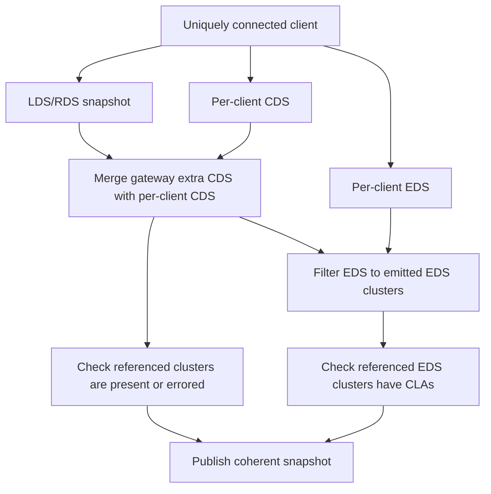

# Design: prevent stale EDS resources from blocking ADS responses

## Status

Implemented in this working tree.

The implementation is in `pkg/kgateway/proxy_syncer/perclient.go`: `snapshotPerClient` now filters EDS resources through `filterEndpointResourcesForClusters` before checking missing referenced endpoint resources and publishing the per-client snapshot.

## Background

Issue [kgateway-dev/kgateway#14184](https://github.com/kgateway-dev/kgateway/issues/14184) reports v2.3.0 upstream connect failures where one data-plane pod for a gateway stopped receiving endpoint updates. The issue includes go-control-plane warnings that ADS was not responding to `ClusterLoadAssignment` requests, plus kgateway logs showing that per-client snapshots were deferred because endpoints, per-client clusters, or referenced clusters were not ready.

PR [kgateway-dev/kgateway#13868](https://github.com/kgateway-dev/kgateway/pull/13868) fixed a reconnect-time race by deferring per-client snapshots until all dataplane-target clusters referenced by LDS/RDS were present or explicitly errored. That made snapshot publication safer, but issue 14184 shows a second property is also needed: after a defer window or backend change, the next published per-client snapshot must make progress and must not contain EDS resources Envoy will not request.

## Problem

In ADS mode, go-control-plane suppresses a named resource response when the snapshot contains resources outside the request name set. For EDS, Envoy requests endpoint resources induced by the clusters currently known from CDS. If the per-client snapshot contains a stale `ClusterLoadAssignment` for a cluster no longer present in the same CDS snapshot, the EDS resource set can be larger than Envoy's requested names.

The observed warning shape is:

```text
ADS mode: not responding to request type.googleapis.com/envoy.config.endpoint.v3.ClusterLoadAssignment [...]
```

The issue-focused TLA+ model in `devel/formal/tla/XdsEdsSubset.tla` captures this minimal failure:

```text
CDS = {cluster-a}
EDS = {cluster-a, cluster-b}
requested EDS = {cluster-a}
responseSent = false
```

The counterexample is not an ACK/NACK or nonce problem. It is a CDS/EDS set-coherence problem that can become a progress problem when the xDS cache retains the last good snapshot during per-client defer windows.

## Goals

- Ensure every newly published per-client snapshot satisfies `EDS resources subset of EDS clusters in CDS`.
- Preserve the existing safety gate that prevents publishing LDS/RDS references to missing clusters.
- Preserve "retain last good snapshot" behavior while inputs are temporarily incoherent.
- Make stale or extra CLAs impossible to publish through `snapshotPerClient`.
- Add regression coverage that reproduces the issue class without relying on timing-heavy e2e tests.
- Use `xdscheck` in tests to catch concrete CDS/EDS closure regressions.

## Non-goals

- Do not change Envoy or go-control-plane behavior.
- Do not remove the per-client defer gate added by PR 13868.
- Do not clear the xDS cache on defer-related delete events.
- Do not model or fix all Kubernetes watch/controller timing behavior.
- Do not add a delta xDS implementation.

## Design

### Snapshot invariant

For every per-client snapshot published to the xDS cache:

```text
EndpointResourceNames(snapshot) subset RequiredEndpointResourceNames(CDS(snapshot))
```

where `RequiredEndpointResourceNames` is computed from every emitted EDS cluster:

```text
if cluster.type == EDS:
    if cluster.eds_cluster_config.service_name != "":
        expected endpoint name = service_name
    else:
        expected endpoint name = cluster.name
```

The existing missing-endpoint invariant also remains:

```text
For every referenced non-errored EDS cluster, its expected endpoint resource exists.
```

Together:

- Missing CLAs cause deferral when a referenced EDS cluster is not ready.
- Orphan CLAs are filtered out and are not published.

### Publication flow

The current per-client flow should stay structurally the same:



The important change is the `FilterEDS` step. Today kgateway filters out CLAs for static clusters. The fix should generalize that filter to keep only CLAs whose names are required by EDS clusters in the merged cluster resources.

### Implementation plan

1. Replace `filterEndpointResourcesForStaticClusters` with a general helper:

```go
func filterEndpointResourcesForClusters(
    clusters envoycache.Resources,
    endpoints envoycache.Resources,
) envoycache.Resources
```

2. The helper should:

- Build `requiredEndpointNames` from all EDS clusters in `clusters`.
- Drop every `ClusterLoadAssignment` whose `cluster_name` is not in `requiredEndpointNames`.
- Drop malformed non-CLA endpoint resources defensively.
- Return an empty endpoint resource set when there are no EDS clusters.
- Recompute the endpoint resource version from the filtered resources, rather than reusing the unfiltered version when membership changes.

3. Update `snapshotPerClient`:

```go
endpointRes := filterEndpointResourcesForClusters(clusterResources, clientEndpointResources.endpoints)
```

4. Keep the existing missing EDS readiness gate after filtering:

```go
missingEndpointClusters := findMissingReferencedEndpointResources(
    listenerRouteSnapshot.ReferencedClusters,
    clusterResources.Items,
    endpointRes.Items,
    clustersForUcc.erroredClusters,
)
```

5. Do not change the delete-event behavior in `proxy_syncer.go`. A defer still removes the UCC from the computed collection, and the subscriber should continue retaining the last coherent cache snapshot.

### Versioning detail

Filtering can change the EDS resource membership even when the underlying endpoint collection did not change. For example, CDS may remove `cluster-b` while the endpoint collection still contains a CLA for `cluster-b`.

If the filtered EDS set changes, the EDS resource version should change. Otherwise go-control-plane can believe the client is already at the current EDS version and open a watch instead of responding. The filter helper should compute the version from the filtered resources, using the same style as existing resource helpers.

### Why not defer on orphan CLAs

An orphan CLA is not a missing dependency. It is stale or unrequested output. Deferring because of an orphan would preserve the bad state longer and could starve the gateway if the stale endpoint object remains in the input collection.

Filtering is the safer behavior:

- It makes the ADS response set compatible with Envoy's named EDS request.
- It preserves valid routes and clusters.
- It lets stale input age out without blocking publication.

## Formal-methods argument

The `XdsEdsSubset` model checks the safe transition:

```text
CDS = {cluster-a, cluster-b}
EDS = {cluster-a, cluster-b}

remove cluster-b safely:

CDS = {cluster-a}
EDS = {cluster-a}
responseSent = true
```

The intentionally buggy config checks a transition that removes `cluster-b` from CDS but leaves its CLA in EDS:

```text
CDS = {cluster-a}
EDS = {cluster-a, cluster-b}
requested EDS = {cluster-a}
responseSent = false
```

TLC reports a two-state counterexample for the buggy config. That does not prove the full production bug, but it gives a precise invariant to enforce in code: EDS must be filtered to the EDS clusters in the same snapshot.

## Test plan

### Unit tests

Add or update tests in `pkg/kgateway/proxy_syncer/perclient_test.go`:

- A snapshot with EDS clusters `cluster-a` and `cluster-b` publishes CLAs for both.
- After `cluster-b` is removed from CDS, the next snapshot publishes only the CLA for `cluster-a`.
- A stale CLA for a removed cluster does not defer publication.
- A static cluster with a stale CLA does not publish that CLA.
- A referenced EDS cluster without a matching CLA still defers.
- A non-referenced EDS cluster present in CDS keeps its CLA, because Envoy can still request it from CDS.

Add `xdscheck` assertions to the proxy_syncer tests by converting the produced `envoycache.Snapshot` into an `xdscheck.Snapshot` and requiring no error findings.

### Existing tests

Keep these focused checks passing:

```bash
go test ./pkg/kgateway/proxy_syncer
go test ./pkg/kgateway/translator/xdscheck
devel/formal/check.sh
```

Run Docker TLC for the passing models:

```bash
TLC_WORKERS=4 devel/formal/tla/check-docker.sh
```

The intentionally failing model should continue to produce the documented counterexample:

```bash
cd devel/formal/tla
java -jar /path/to/tla2tools.jar -config XdsEdsSubsetBug.cfg XdsEdsSubset.tla
```

## Rollout

This fix only changes developer/test validation and the per-client snapshot resources published by kgateway. It should not change user-facing APIs.

Expected runtime behavior:

- Fewer or no go-control-plane `ADS mode: not responding` warnings caused by stale EDS resources.
- No clearing of the xDS cache during defer windows.
- Valid routes continue serving from the last coherent snapshot until a new coherent snapshot is available.
- Once inputs become coherent, a new snapshot publishes with CDS and EDS aligned.

## Risks

- Recomputing EDS versions from filtered resources must be deterministic.
- Filtering must include service-name based EDS resources, not only cluster-name based resources.
- Filtering must include all EDS clusters in CDS, not only route-referenced clusters, because Envoy can subscribe to endpoint resources for any emitted EDS cluster.
- Tests should avoid relying on KRT timing. Prefer static collections and explicit updates.

## Open questions

- Should `xdscheck` be run automatically in selected proxy_syncer tests, or only in translator tests plus targeted unit tests?
- Should production code emit a debug metric/count for filtered orphan CLAs to make future incidents easier to diagnose?
- Should we add a bounded retry or resync trigger for UCCs that remain deferred for too long, separate from this EDS filtering fix?
