# Plan to complete the xDS formal methods research program

Review date: September 10, 2026

Research branch: `chandler/kxdsformalmethods`, reviewed at `54007c4fe4`.
Comparison baseline: `b50b0084fb`, immediately before the first formal-methods commit. The research series changes 110 files, with roughly 15,700 insertions. This is a research branch with experimental production changes, not just a collection of models.

## Objective and recommended direction

The objective in `~/t/formal_agent.txt` evolved from an xDS MVP to an implementation-linked specification: unbounded safety proofs where appropriate, executable model checking, Go trace conformance, and explicit assumptions tested against the actual dependencies. Startup, warming, reconnects, issues 13868 and 14184, and finding new defects are central. The transcript repeatedly asks whether the models can detect bugs in real Go code. This branch is a research vehicle; extracting product fixes is a separate activity.

The next milestone should be **a versioned, evidence-backed assurance case for the deployed xDS publication pipeline**, with a reproducible scope inventory and executable counterexamples for the important historical failure classes. It should say exactly which guarantees hold, for which implementation and configuration, under which assumptions, and what detects violations.

The highest priority is repairing model fidelity and the checking machinery before extending the existing proofs. In particular, go-control-plane must become an explicit modeled subsystem. A green test named in a ledger does not establish the full statement written next to it.

We cannot establish that we know every possible xDS bug. We can establish a defensible scope: complete accounting of a frozen source/feature inventory, reproducible historical searches, explicit dispositions for discovered mechanisms, implementation/model correspondence, and adversarial validation of the checker itself. Completion is relative to that inventory and dependency profile, with a process to reopen it when either changes.

## What this review established

### Useful work to preserve

- Seven TLA+ models cover publication, reconnect readiness, named EDS watches, convergence, and warming, including deliberately failing configurations.
- Lean proves inductive safety for the abstract convergence machine over arbitrary resource names and lifts it to arbitrary clients. Additional executable models cover per-cluster readiness, client identity, and ADS ordering.
- `xdscheck` checks substantial concrete reference closure, including ancillary service clusters and recognized SDS references.
- Real go-control-plane server probes cover ordering and callback serialization; KRT/property tests and Envoy e2e fixtures connect parts of the abstractions to implementation behavior.
- The assumption and model maps distinguish some known divergences and an open KRT progress obligation. These are good foundations for an evidence ledger.

### Findings that prevent treating the program as complete

| Priority | Finding and evidence | Required correction |
|---|---|---|
| P0 | `devel/formal/lean/XdsSpec/Checker.lean:108` calls `canReach` from each premise state. This establishes existence of a path, not a temporal leads-to property on all fair executions. Its comments equate the two without representing fairness. | Rename the existing check as reachability/recoverability; implement fair-cycle checking or use TLC for temporal claims. Prove temporal progress separately. |
| P0 | `Liveness.lean:66` proves `exists s', SafeSteps s s' AND Converged s'`, using a heartbeat that supplies a closed candidate. It does not prove that a scheduler executes that path, that a real watchdog runs, or that genuinely empty/invalid input becomes ready. | State this as a constructive recovery theorem. Add environment-specific fairness and permanent-input cases before claiming convergence. |
| P0 | GCP-A1 says response occurs iff version differs and snapshot names fit the request. v0.14.0 `CreateWatch` also responds at equal version for newly subscribed/unreturned resources. Its declined immediate response registers no watch; its publish path deletes a declined parked watch. The current abstract response step leaves room for later recovery without that lost-watch lifecycle. | Model both entry paths, subscription history, response eligibility, and watch disposition; revise GCP-A1 and dependent claims. |
| P0 | ENV-A1 says Envoy keeps old routes until an ACKed cluster has a usable endpoint. The named e2e tests pass through kgateway's own readiness gate, so they cannot isolate that Envoy guarantee. The protocol explicitly permits reference-ahead blackholes and distinguishes ACK from successful application. | Test a directly driven Envoy, model its actual behavior, and put any stronger publication policy in the kgateway model. |
| P0 | `TraceCheck.lean:151` checks each publish independently; it does not replay `applyAction`, maintain per-client state, or observe watches, wire responses, ACK/NACK, reconnects, cache deletion, or activation. Version checking is explicitly excluded. All other decision strings count as defers. | Build a stateful conformance relation and strict trace schema. As a reproduced negative test, decision `publsih` with a missing referenced cluster returns PASS with 0 publishes and 1 defer. |
| P1 | The composed theorem does not cover the full product of the separate models. `beginNextEpisode` waits for activation, while real updates can overlap warming and unacknowledged responses. The multi-client theorem isolates abstract state by construction, not cache locks, shared keys, queues, or resources. | Admit overlapping updates and shared implementation state; prove or test the composition assumptions explicitly. |
| P1 | The current branch's `syncXds` indefinitely withholds first publication on deferred input without a cached snapshot. Held flips retain entire route/listener/secret resource types. Permanent empty inputs and independent route/certificate updates are insufficiently covered by the current progress story. | Reproduce cold/warm permanent-empty and whole-type starvation cases before choosing publication policy. Do not assume eventual nonempty endpoints. |
| P1 | `OrderedADS.lean` identifies real ordering windows, but the safe removal action checks that the route is already inactive. A fixed grace timer does not implement that guard without a bound on delivery/application. | Distinguish an observed dependency barrier from a probabilistic time grace; model delayed/lost ACKs, NACKs, worker application, and timeout policy. |
| P1 | IMPL-A1 is recorded as discharged although a finite-width XOR digest cannot be injective over unbounded content. Lean represents versions by name sets, omitting same-name payload updates; Go does hash endpoint payloads. | Model payload revisions and state the collision assumption honestly, or use an explicit revision allocation contract. Corpus tests are evidence, not an injectivity proof. |
| P1 | v0.14.0 `SetSnapshot` stores the snapshot before responding to watches and can return an error after some responses. The comment in `kube_gw_translator_syncer.go` that a rejected snapshot leaves the client on its previous configuration is not a transactional cache guarantee. Trace emission is also before this result. | Represent built, cache-installed, response-enqueued, sent, accepted, and active states separately. Probe partial publication and cancellation. |
| P1 | The assumption gate checks that test declarations and anchor strings exist. The formal workflow's PR paths omit `go.mod`, `go.sum`, setup, identity code, the ledger, validator, and e2e sources. The Lean runner selects `TestSnapshotPerClient`, omitting several dependency probes; missing `lake` returns success locally. | Require execution receipts, fail closed for required jobs, and run on every relevant dependency/implementation change. Preserve an explicitly optional local runner if useful. |
| P2 | README claims such as no production changes and future Lean work are stale. Published fixes described in the second transcript have evolved away from some research policies. | Publish a current guarantee/status table and pin separate research, deployed, and proposed profiles. Do not silently change a model to match a new product decision. |

A concrete counterexample to the checker's fairness claim: states A and B can cycle forever; an exit to G is enabled only at A. G is reachable from both A and B. Alternating A/B forever can satisfy weak fairness because the exit is never continuously enabled. A reachability check passes while eventual G is false. The general checker needs to detect such fair counterexample cycles or restrict and prove the graph conditions under which its shortcut is valid.

## How we establish what must be modeled

Use four independent discovery inputs. The union is the scope inventory; none is a substitute for the others.

### Protocol and feature inventory

Enumerate every relevant rule from a pinned xDS specification and every resource/protocol mode exposed by the chosen deployment. Record its implementation owner and a model obligation or explicit exclusion. Inventory all registered services even when the normal bootstrap does not use them.

Include LDS/CDS full-state behavior versus named RDS/EDS/SDS behavior; wildcard history versus unsubscribe-all; newly requested resources at unchanged version; stale nonces; per-stream generations; partial application on NACK; removal semantics; initial-fetch timeouts; TTL/heartbeats when enabled; dynamic dependencies; bootstrap/static resources; and multiple xDS authorities or streams where present.

Begin with SotW ADS and the exact snapshot-cache/server configuration used here. Audit Delta, Fetch, LinearCache, MuxCache, LEDS, SDS/ECDS/SRDS and custom services for actual reachability and historical mechanisms. Implement separate models for deployed paths. Keep nondeployed variants explicitly excluded from the initial guarantee, with an activation gate before adoption. A bug in an excluded path can still reveal a shared mechanism worth modeling.

### Source and concurrency inventory

Starting at bootstrap and `NewControlPlane`, trace the entire path:

```mermaid
flowchart LR
    I[Inputs and client identity] --> K[KRT derivation]
    K --> T[Translation and validation]
    T --> P[Per-client composition and versions]
    P --> C[Cache installation and watches]
    C --> S[Server queues and stream lifecycle]
    S --> E[Envoy acceptance and warming]
    E --> D[Worker application and traffic]
    E --> S
    D --> O[Status and observability]
```

For every early return, lock, asynchronous callback, channel send, cancellation, cache mutation, equality suppression, retry, timer, and resource deletion, answer:

- What state changes, and what state remains retained?
- Is the operation atomic? What can another goroutine observe between its steps?
- Can an event be ignored, overwritten, coalesced, delivered late, or never retried?
- After failure or silence, who initiates the next event? What if that party never does?
- Can another type, stream, proxy, resource, or tenant be blocked?
- Which observable distinguishes progress from merely staying connected?

Require a disposition for every relevant path. The instruction is not to model every Go line: abstract away details only after documenting why they cannot change the property being checked. In particular, inspect every "Envoy will request again" assumption against the client code and a silent-client test.

### Historical defect corpus

Include all six requested repositories from the beginning: `envoyproxy/envoy`, `envoyproxy/go-control-plane`, `solo-io/solo-projects`, `solo-io/gloo`, `kgateway-dev/kgateway`, and `envoyproxy/gateway`. Include `solo-io/solo-kit` as a dependency-lineage audit because its cache fork is directly relevant. Search other clients such as Istio or Contour when cross-links lead there; do not expand to their entire product scope automatically.

Use read-only API queries and local read-only history. No GitHub comments, issues, PRs, or git mutations are needed.

1. Freeze a cutoff date and repository identities. Record repository transfers, forks, redirected URLs, issue IDs, and fix lineage so the gloo/kgateway history is neither lost nor double-counted.
2. Export issues, PRs, comments, linked fixes and regression tests. Do not limit to open issues or a `bug` label: stale-closed issues, unmerged fixes, reverted fixes, release notes, and commits without issues matter.
3. Search both protocol terms and symptoms: xDS/ADS/SotW/delta/CDS/EDS/LDS/RDS/SDS, watch/nonce/subscription, warming/init/readiness, stale endpoints, restart fixes it, NACK/rejected/invalid, freeze/hang/deadlock, drain/removal, version/hash, fan-out/locality/identity, reload/rotation, and response/channel/cancel.
4. Enumerate changes to the relevant cache/server/subscription/Envoy source paths even when commit messages contain none of those words. Walk linked issues, tests, reverts, release branches, and follow-up fixes to closure.
5. Paginate and partition searches by creation date before hitting GitHub's search-result cap. Preserve exact query text, page totals, timestamps, incomplete-result flags, inaccessible sources, and deduplication decisions. Search totals are discovery statistics, not a denominator for "all bugs."
6. Classify each candidate as a verified defect, plausible report needing reproduction, design limitation, duplicate, or nonapplicable. Record a reason for exclusions. A closed issue is not proof of a shipped fix; verify the code and release ancestry.
7. Reduce each relevant defect to a causal mechanism and minimal event trace. Add a model counterexample and an implementation regression test where reproducible. If the model cannot express the trace, open a scope gap before calling the bug covered.
8. Reserve a portion of historical mechanisms as a holdout set. After modeling the discovery set, try to represent and detect the holdouts without adding state. Add new state when necessary and report the resulting model changes. This tests generalization beyond handpicked counterexamples.

Corpus entry fields: stable ID, repository/issue/fix identity, visibility, source revision, affected/fixed version evidence, report confidence, deployment applicability, symptom, mechanism, trigger/preconditions, minimal schedule, expected behavior, violated property, model elements, reproducer, repaired witness, test job/receipt, related mechanisms, and remaining uncertainty.

Private reports and full exports stay in local/private research storage. Public regression cases should contain only the independently reproducible technical mechanism. This plan lives in `devel/formal/`; the source transcripts remain in local research storage.

### Adversarial and composition discovery

Generate failures that history has not yet reported. Cross lifecycle stages with restart, cancellation, partial rejection, delayed callbacks, queue pressure, and permanent unavailability. Prioritize three-way combinations with shared state rather than indiscriminately enumerating every product combination.

Examples: unsubscribe while a response is queued; controller restart while a warm proxy shares a key with a cold proxy; partial CDS NACK plus healthy-backend EDS churn; a route flip to a permanently empty backend during certificate rotation; same resource names with changed payload and unchanged parent subscription; shared service names during deletion; and stale callback completion after identity replacement.

Mutation testing must target both implementation and the verification harness: omit trace events, relabel decisions, reuse versions, suppress retries, retain stale identity, drop a watch at either entry path, apply only part of a response, and block a shared lock. A green suite that accepts these violations is itself a finding.

## Historical reconnaissance from this review

This was a seed audit, not an exhaustive review of all past bugs. Read-only API access worked for all six repositories. A single broad `xds` search returned 2,230 candidates for Envoy, 378 for go-control-plane, 200 for solo-projects, 29 for gloo, 660 for kgateway, and 1,678 for Envoy Gateway. Counts include issues and PRs and depend on indexing/permissions; they demonstrate why a few web searches or a 1,000-result export would be insufficient.

| Seed evidence | Model dimension it requires |
|---|---|
| Existing branch investigations of 13868/14184 and identity drift | Partial input, retained cache, per-client identity, reconnect, and dependency closure |
| [go-control-plane #46](https://github.com/envoyproxy/go-control-plane/issues/46) | Repeated NACK of unchanged content, retry damping, and shared-resource pressure |
| [go-control-plane #1498](https://github.com/envoyproxy/go-control-plane/pull/1498) | Superseded watches, queued responses, unsubscribe history, and checks at send time |
| [Envoy #13009](https://github.com/envoyproxy/envoy/issues/13009) | Parent update with unchanged EDS content/subscription; warming may still need another response |
| [Envoy #10363](https://github.com/envoyproxy/envoy/issues/10363) | Subscription changes crossing an in-flight response and stale nonce handling |
| [Envoy #36951](https://github.com/envoyproxy/envoy/issues/36951) | Reconnect while resources are warming and discovery requests are paused; Delta report with potentially transferable lifecycle mechanisms |
| [Envoy #12138](https://github.com/envoyproxy/envoy/issues/12138) | Large CDS updates, paused EDS, scheduler delay, and progress under load |
| [kgateway #14352](https://github.com/kgateway-dev/kgateway/issues/14352) | Legitimately permanent empty inputs, first publication, startup-probe budgets, and scale-out |
| [kgateway #14264](https://github.com/kgateway-dev/kgateway/issues/14264) | Recovery after invalid configuration is corrected while healthy endpoints continue changing |
| [Envoy Gateway #9726](https://github.com/envoyproxy/gateway/issues/9726) | Ancillary ext_proc/ext_authz clusters and client-certificate SDS dependency closure |
| [Envoy Gateway #9198](https://github.com/envoyproxy/gateway/issues/9198) | Separating accepted API configuration from dataplane acceptance and warm/cold proxy outcomes |
| Second transcript's solo-projects and solo-kit investigations | Sanitization/version mismatch, partial application, retry reset, declined-watch retention, and fork bug parity |

These reports motivate dimensions; this review does not independently confirm every reported root cause or current fix status. Especially avoid converting "bad configuration followed by stale endpoints" into a specific cache diagnosis without a reproducer.

The [xDS protocol](https://www.envoyproxy.io/docs/envoy/latest/api-docs/xds_protocol) independently requires distinctions the current seam underrepresents: ACK versus application, NACK with partial acceptance, subscription history, and type-specific deletion behavior. Use pinned versioned documentation and Envoy source for implementation conclusions; the moving latest documentation is a discovery source.

## Mandatory go-control-plane work package

The branch pins root module v0.14.0 and Envoy image v1.37.2. The user's `~/git3/go-control-plane` checkout is now at `0e94dc4463db58c4553b5db3b41b85a5035b304d`, not v0.14.0. This review therefore read the tag directly and reran probes using an isolated copy of the module-cache v0.14.0 sources. Never infer the tested version from the checkout directory name or transcript.

Maintain separate immutable profiles for the branch pin, each supported deployed pin, and candidate upgrades. Root go-control-plane, generated protos, gRPC, Envoy binary/runtime flags, bootstrap, server mode, and wrappers all belong in the profile. The earlier main review is useful evidence for its audited revision, not evidence about today's moving main.

Audit `pkg/cache/v3/simple.go`, `snapshot.go`, `order.go`, resource/version handling, `pkg/server/sotw/v3/{server,xds,ads}.go`, stream subscriptions, and the v3 callback adapter. Also inspect any wrappers in `~/k_k-go-control-plane-fixes` before treating their proposed mitigation as a solved obligation.

| Subsystem | Required state and failure transitions | Minimum executable evidence |
|---|---|---|
| Cache installation | Snapshot replacement, per-type versions, immutability, errors after partial response, cleared snapshots/status | Install under cancellation; read back cache; observe each answered and unserved watch |
| Watches | Absent/open/responded/declined/discarded/canceled; request entry and publish entry; ownership of cancellation | Both v0.14.0 discard probes, recovery without unsolicited client retry, cancel/publish races |
| Subscriptions | Explicit/wildcard/unsubscribe-all history, returned names, absent/newly requested names, service-name aliases | Equal-version subscribe; deletion and re-addition; unchanged parent names; named EDS/RDS/SDS |
| Stream server | Type nonce, stream generation, last sent/ACKed versions, queued response provenance, supersession | Stale nonce with changed names, reconnect nonce reset, queued stale response after unsubscribe |
| Ordering | Open-watch availability, cache enqueue order, busy/quiet server scheduling, ACK skew | Existing three probes plus deterministic scheduling barriers and actual Envoy application observations |
| NACK/retry | Rejected content, partial apply, next trigger, backoff/jitter/reset/cancellation | Invalid to corrected config; unchanged NACK loop; healthy type and client progress during rejection |
| Concurrency | Global/per-node locks, channel capacity, blocked sends, callback order, close on error | Full-channel hazard, slow client isolation, concurrent client callbacks, resource cleanup |

Important inherited findings to re-derive, not simply copy:

- v0.14.0 discards on both declined-watch paths. `bf9b60b56` changes the publish path; the reviewed newer checkout still explicitly drops declined new requests. Track these as separate obligations.
- Equal-version responses depend on subscription/returned-resource state. The simplified "version differs iff response" rule is wrong.
- Retaining a watch cannot make an incompatible snapshot answerable. A mitigation must show both retention and eventual eligibility; it does not by itself solve every CDS-NACK blackout.
- The prior report's reasoning that CDS/EDS alignment guarantees an eventual client re-request needs its own proof and Envoy probe. Rejection, unchanged accepted subscriptions, and control-plane-side realignment challenge that inference.
- The immediate response path can hold the global cache lock with a background context. Verify buffer capacity and pending-response bounds for each server mode and wrapper before declaring this unreachable.
- A stream-local sleep may still delay unrelated resource types on that stream. NACK damping needs cancellation, per-type policy, and healthy-resource progress tests.
- Type ordering observed by a scripted stream is not a theorem about every schedule, nor evidence that every Envoy worker has applied the configuration.

## Target model structure and properties

Use a common vocabulary and event schema across small composable models. Keep normative policy separate from descriptive dependency behavior. The descriptive Envoy/go-control-plane models must permit observed bad behavior; the kgateway policy model can then be checked for whether it prevents that behavior from reaching users.

Model layers: input/identity derivation; snapshot construction; cache/watch lifecycle; stream transport; Envoy acceptance/warming/application; status and recovery. Define abstraction functions and ownership boundaries before claiming composition. Lean is suited to unbounded structural invariants and refinement lemmas; TLC is suited to concurrent schedules and fair temporal properties. There is no requirement to duplicate every model in both languages. Shared fixtures and cross-checks should detect semantic drift.

Required property families:

- **Structural correctness:** unique names and typed references resolve to a dynamic resource, a declared bootstrap/static dependency, or an explicit unsupported case. Missing dynamic CDS is not automatically proof that a bootstrap-supplied cluster or its EDS assignment is orphaned.
- **Version correctness:** visible content changes are reflected in response eligibility, including content changes without name changes, filtering, synthesis, sanitization, carry-forward, and error/recovery. Separate collision assumptions from deterministic algorithmic guarantees.
- **Protocol safety:** responses belong to the live stream/subscription generation; stale ACKs do not advance acceptance; NACK is not modeled as an atomic rollback of all resources.
- **Activation correctness:** distinguish missing CLA, received empty CLA, nonempty endpoints, healthy/selectable endpoints, cluster initialization, listener activation, and actual request success. Include cached resources, timeouts, DNS, workers, and secret dependencies where they affect these states.
- **Progress:** stable valid truth eventually reaches the intended clients under explicitly stated fairness and connectivity assumptions. Permanent empty/invalid dependencies lead to an explicit available/degraded/rejected outcome rather than an implicit forever-wait assumption.
- **Isolation:** one rejected resource, stalled type, bad backend, or slow client has a defined blast radius. Test unrelated routes and certificate rotation as well as unrelated endpoint updates.
- **Security:** retaining last-good state cannot silently preserve revoked credentials or an invalid security policy contrary to the selected fail-closed contract. Availability and security obligations need separately classified expected failures.
- **Recovery:** controller/proxy restart, same-key concurrent streams, HA failover, cancellation, and resource removal do not strand delivery; any recovery timer actually rereads authoritative state rather than repeating a stuck cached derivation.
- **Observability:** cache installation, send, acceptance, activation, and health are distinct. Stalled required progress is detectable. A connected stream, unchanged quiet stream, or an old response timestamp alone is not a failure signal.

## Ordered implementation plan

### Phase 0 Establish the baseline and repair evidence claims

Deliver a profile manifest, guarantee table, and corrected assumption statuses. Reconcile the research implementation with relevant current fixes by reading pinned source/diffs; do not change branches or transplant changes during this planning task. Label claims as proved-in-model, model-checked-with-bounds, implementation-characterized, contradicted, open, or excluded. Record tests as execution evidence rather than universal discharge.

First changes should fix strict trace decision parsing, required-field validation, test/scenario identities, mandatory event coverage, and the reachability/liveness terminology. Add negative tests for both checkers. Make explicit that unbounded cardinality does not imply arbitrary interleavings or a proof of the implementation.

Exit: every present guarantee has a precise subject and evidence level; known false ledger statements are no longer marked discharged; malformed or coverage-empty traces fail.

### Phase 1 Build the source inventory and historical corpus

Execute the four discovery inputs above, starting with go-control-plane and the six requested repositories. Work incrementally: initial high-risk mechanisms should feed models immediately while the full corpus accounting continues. Include a review of exclusions and independently discovered/held-out cases.

Deliver `scope`, `bug-corpus`, `assumptions`, and `obligation-map` records, with private evidence stored separately. Each obligation links mechanism -> model -> theorem/check -> concrete reproducer -> CI job/receipt.

Exit: every relevant source path and deployed feature has a disposition; the frozen historical search is fully paginated/accounted for; every candidate has a classification and every relevant mechanism has an obligation or explicit open gap.

### Phase 2 Model and probe the actual cache and server

Port the earlier cache/server probes into the research harness, parameterize them by immutable dependency profile, and add cancellation, partial installation, equal-version subscription, stale queue, and NACK recovery cases. Develop the executable descriptive state machine from those code paths. Reproduce both broken and repaired watch-lifecycle traces.

Use differential tests against the real snapshot cache and server, with deterministic barriers around race boundaries. Preserve characterized defects without counting them as satisfied safety requirements. A dependency upgrade should produce an explained behavior diff.

Exit: every relevant go-control-plane branch/state transition is modeled or explicitly abstracted; all known dependency findings have reproducible witnesses and separately stated expected repaired behavior.

### Phase 3 Characterize Envoy and permanent-input behavior

Drive the pinned Envoy directly from a scripted xDS server, independent of the kgateway readiness gate. Capture requests/responses, admin state, and traffic. Exercise missing/empty/ready/unhealthy EDS, unchanged EDS on CDS rewarming, route-before-cluster, dependency removal, partial NACK, SDS absence/rotation, timeout, restart, and paused discovery.

Add permanent-empty cold start, warm reconnect after controller restart, shared-key cold/warm clients, unrelated route churn, and certificate changes during held flips. Classify expected degraded traffic explicitly. These cases decide which publication guards and fallback policies are appropriate; do not bake a universal no-503 policy into the environment model.

Exit: ENV assumptions have isolated evidence against the exact binary/configuration, and the normative publication policy addresses both convergence and permanent unavailability.

### Phase 4 Compose the state machines and prove the useful claims

Admit overlapping revisions, partial responses, shared resources/keys, and more than one stream per client group. Prove structural safety and explicit refinement/assume-guarantee obligations in Lean. Check temporal properties with fair-cycle semantics, or prove the required restrictions before using a simpler checker.

For each progress theorem, name the fairness obligations, allowed permanent faults, and whether the result is qualitative eventuality or a real-time bound. A five-transition path is not a five-step deployment guarantee. A timer cannot establish remote application without corresponding evidence or an assumed latency bound.

Exit: claims hold for the composed deployed profile; each assumption is tested, justified as an abstraction, or visibly remains open. Bounded results report their domains and schedules, and unbounded results report their exact quantifiers.

### Phase 5 Make the implementation conform and make CI enforce it

Record lifecycle events at actual state transitions: input generation, candidate build, cache installation/result, watch open/cancel/decline/discard, enqueue/send, ACK/NACK, reconnect, and observed activation. Include scenario ID, process/stream generation, client/cache key, resource type, version/nonce, subscription generation, and resource identity/payload revision. Do not record secret bodies.

Replay each trace through a relation to the model, permitting legitimate internal stuttering. Use the model's predicates directly or prove equivalence of checker predicates. Validate sequence completeness and partial-order consistency; a missing event must not quietly become an allowed defer. Keep test-oracle extraction independent from production readiness/reference collectors where practical, to reduce shared blind spots.

Generate stateful event sequences and scheduling perturbations, shrink failures to reusable traces, and replay the same cases against old/fixed profiles. Finite tests cannot prove infinite liveness; use controlled stabilization windows and explicit watchdog/deadline properties to test the corresponding assumptions.

Required CI layers: fast strict-checker negative tests; unbounded proofs; bounded safety/temporal models; dependency probes; corpus regressions; stateful Go tests; and a pinned real-Envoy subset. Nightly/upgrade jobs expand seeds, schedules, versions, and scale. Run the ledger tests themselves and enforce that referenced probes execute. Record tool versions, source/profile digest, seed, bounds, test outcome, and artifacts. Required jobs must fail rather than silently skip missing tools or missing traces.

Exit: representative implementation mutations and trace/checker corruptions fail the intended gate; dependency bumps and changes to setup/identity/translation/ledger/e2e paths trigger relevant verification; failures have reproducible artifacts.

### Phase 6 Close the bounded research program and maintain it

Publish an assurance report answering what is covered, what remains uncertain, and which guarantees depend on configuration choices. Re-run held-out historical cases and evaluate model additions they required. Review all remaining unknown/excluded items by severity; unresolved critical obligations prevent declaring the initial program complete.

Extract product fixes and portable tests separately, preserving the experimental branch's role. Maintain an upgrade and incident process: every new feature, dependency change, and xDS incident reopens the relevant inventory entries and adds a minimized trace.

Exit: the agreed scope inventory is accounted for, critical properties have appropriate evidence, all relevant historical mechanisms have a disposition, required gates execute, and remaining limitations are specific and accepted. This closes a defined program, not the universe of possible xDS behavior.

## Immediate next work in priority order

1. Repair the trace checker and distinguish recoverability from temporal liveness. These are defects in the instrument used to judge everything else.
2. Port and model both go-control-plane declined-watch paths, equal-version subscription, and partial cache installation. Reopen GCP-A1 rather than preserving its current proof narrative.
3. Use a direct Envoy harness to replace ENV-A1 with measured warming/activation semantics. Include permanent-empty and unchanged-EDS cases immediately.
4. Build the cross-repository corpus and source-path inventory, mapping mechanisms into these models as discoveries arrive.
5. Compose the corrected models and implement real lifecycle trace conformance; then extend unbounded proofs and CI coverage.

## Validation performed for this review

- `CGO_ENABLED=0 go test -tags e2e ./devel/testing ./pkg/kgateway/translator/xdscheck`: passed.
- `CGO_ENABLED=0 devel/formal/lean/check.sh`: passed; Lean rebuilt, model-check expectations held, selected proxy-syncer tests passed, and 404 trace events (204 publishes, 200 defers) passed the current checker.
- `CGO_ENABLED=0 go test -tags e2e ./pkg/kgateway/proxy_syncer -run '^TestADS' -count=1`: passed, covering the existing ordering and callback probes.
- Deliberately malformed decision trace at `/tmp/xds-formal-invalid-decision.jsonl`: incorrectly accepted, confirming the strict-parsing/coverage gap.
- Five prior cache probes against isolated v0.14.0 sources: passed, including both discard paths, equal-version subscription, wildcard behavior, and the full-channel cache-lock hazard. They characterize behavior, including defects; passing is not a correctness verdict.
- The sixth prior probe, against the real v0.14.0 server/cache, passed and measured 38,662 repeated sends of a NACKed version in 300 ms with a scripted client. This is a mechanism characterization, not a real-Envoy throughput prediction. The upstream package has an unrelated modern-Go vet format error in `delta_test.go`; this server characterization was rerun successfully with `-vet=off` specifically for that upstream package. The scratch module used the research branch's dependency declarations, with the module name adjusted to compile the copied upstream sources; no branch dependency files were changed.
- No TLC rerun, live Envoy characterization, complete historical corpus audit, or whole-repository test run was performed as part of this planning review.
- Git state and GitHub were not mutated. The plan was subsequently moved into `devel/formal/` at the user's request; scratch validation artifacts remain outside the branch.

Local inputs: `~/t/formal_agent.txt`, `~/t/formal_agent2.txt`, `~/t/go-control-plane-v0.14.0-formal-review.md`, and `~/t/go-control-plane-main-review.md`. Review logs: `/tmp/xds-formal-review-check.log`, `/tmp/xds-gcp-review-probes.log`, and `/tmp/xds-gcp-review-nack.log`.

## Status update, September 11, 2026

Work since the review, in commit order on `chandler/kxdsformalmethods`, with
the ledger entry each item advances. Nothing below closes a phase.

1. RF-003: cache-boundary probe and weakly fair TLC model for a permanently
   missing referenced cluster on a cold proxy; a proposed classification
   policy is modeled, not implemented.
2. RF-024 (new): a backend whose translation returns no cluster is dropped
   without an errored record; reproduced with a synthetic plugin.
3. RF-008: `VersionDigest.lean` states the digest contract and proves the
   name-set abstraction payload-blind; schema-2 traces carry per-CLA digests
   and the checker fails version reuse per client. RF-025 (new) records
   version churn from the carry suffix and the branch-dependent version
   function.
4. RF-007, RF-018: probes replayed against unreleased upstream revisions
   through `gcpprobe/replay-profile.sh`; #1356 repairs the probed unsubscribe
   leak and retains the declined parked watch; #1498 targets a schedule the
   real SnapshotCache cannot produce, which a new probe constructs.
5. RF-004, RF-026 (new): the direct Envoy `references` scenario shows a
   dangling RDS reference is a per-route 503, an inline LDS reference rejects
   the listener, and SotW rejection applies the valid siblings of a NACKed
   CDS or LDS response while the request reports the previous version.
   `PartialRejection.lean` states which properties each semantics keeps.
   kgateway derives only metrics and a log from NACKs.
6. RF-012: the same scenario through SnapshotCache measures the NACK resend
   recurrence on a real Envoy in both ADS modes.
7. RF-006: syncXds emits installation receipts; the checker relates them to
   decisions per client in order on the full per-type version tuple, with
   explicit accounting for KRT coalescing and suppressed recomputations.

### Second tranche, same day

8. RF-006: installation receipts and the per-client FIFO relation on the
   full version tuple; the randomized scenario now ends quiescent.
9. RF-002, RF-021: `xdscheck.DependencyGraphOf` and `Components` compute the
   publication partition; all golden fixtures already pass xdscheck without
   warnings, so no fixture has an opaque component.
10. RF-005: `KrtRecovery.tla` states recovery under explicit fairness; no
    deployed watchdog exists, so progress rests on KRT delivery.
11. RF-026: EDS and RDS reject whole responses while CDS and LDS apply valid
    siblings; the storm measurements cover all four types.
12. RF-027 (new): SDS removal is ACKed and revokes nothing; kgateway revokes
    by changing the referencing listener, cluster, or filter, which the audit
    confirms for every emitted secret edge.
13. The research harness is lint-clean under make analyze.

### Third tranche, same day

14. RF-027 (new): SDS removal is ACKed and revokes nothing on the pinned
    Envoy; kgateway revokes by removing the referencing filter, listener, or
    cluster, confirmed by source audit and a translator fixture that deletes
    the OAuth2 client Secret.
15. RF-025, RF-009: a trace scenario with real endpoint translation shows
    EndpointsHash content-idempotent for pod-set changes; the randomized
    scenario now ends quiescent so the installation relation is stable.
16. RF-016: eleven go-control-plane candidates classified against the probes
    and models; both held-out mechanisms probed on the pin (#431 repaired,
    #505 reproduced but unreachable: kgateway never calls ClearSnapshot).

### Fourth tranche, same day

17. RF-006: subtest boundary events so per-client trace relations do not
    leak across subtests; direct-install segments are counted, not matched.
18. RF-001, RF-004: direct restart scenario, control plane with an empty cache
    then the proxy container against the warm cache; reconnect carries
    versions and no nonce.
19. RF-003, RF-004, RF-010: initial fetch timeouts measured (missing EDS and
    RDS degrade to active states sequentially across init phases; a route
    ahead of its cluster is a 503 window); Envoy #21425 does not reproduce.
20. RF-026, RF-027: SDS rejects a whole response like EDS and RDS (Envoy
    Gateway #9463 reproduced); a provider-key change is served over SotW
    (Envoy #47309 not reproduced); the standalone SDS server serves all three
    RPC modes to any Node identity.
21. RF-016: forty-four corpus dispositions across all four core repositories
    with two remaining hold-outs (a Delta xDS report and a status-path
    report), both outside the deployed path.

### Fifth tranche, same day

22. RF-001, RF-009: the live `XdsWarming` and `XdsStarvation` suites passed
    six of six against the research image on an isolated kind cluster; the
    run is pass/fail only because the controller emits no snapshot trace.
23. RF-016: the corpus reached fifty-one dispositions with Gloo and solo-kit
    lineage entries; RF-026 gained the measured per-family table in Lean.

### Sixth tranche, same day

24. RF-016: seventy-two dispositions after second go-control-plane, kgateway,
    and Envoy batches; kgateway #14453 corroborates the RF-012 resend loop in
    the field, and #14453, #14447, #13830, #13841 form an accepted-by-kgateway,
    rejected-by-Envoy family whose NACK never reaches status (RF-026).
25. RF-007: the version-skew EDS blackout of kgateway #14471 is pinned through
    the real cache; the production binary never installs the trace sink, so
    live runs stay pass/fail until RF-009 adds a trace flag.

### Seventh tranche, same day

26. RF-028 (new): a controller restart while a CDS revision is warming
    leaves the reconnected Envoy re-requesting EDS, LDS, and RDS but not CDS
    until an EDS revision completes the warming; Envoy #36951 and #34334
    reproduce over SotW in both ADS modes. A withheld or equal-version-parked
. RF-029 (new, candidates): PR #14604 review items relayed from a peer
    session and checked against the diff and pinned sources: a retainer
    forget race (two-proto window), full nested walks in proto.Equal on the
    pinned protobuf, an upgrade-time EDS version move (RF-025), the
    `+noKrtEquals` marker as an unproven injectivity claim (RF-008), and an
. RF-029 action 1 closed: a Service `trafficDistribution` change reaches
    `LbEpsEqualityHash` through the upstream hash, and the editor path is
    versioned by the plugin contribution; the existing krtcollections test
    plus two new receipts pin it and the receipt gate now runs the
    `krtcollections` and `endpoints` packages. RF-024 has a fix on a
    main-based branch (0841e73066), recorded, not ported pending the remedy
    decision.
29. RF-028 action 3: `ReconnectWhileWarming.tla` states the paused-CDS reconnect;
    the equal-version rule fails `EventuallyRepaired` without an endpoint
    change, the proposed unconditional first response passes.
30. RF-028 corrected: kgateway's bootstrap enables the EDS cache for ADS and
    leaves the EDS fetch timeout unset (15 s), so the reconnect-while-warming
    window is bounded by that timeout; measured in two new Envoy profiles,
    modeled as `EdsCacheFallback`. RF-014 and RF-017 parks are bounded the
    same way in the deployed bootstrap.
31. RF-024, RF-003, RF-009: the shared-base CDS stack (head 5da2acd8ec) drops
    unsupported backends the same way in `TranslateBackendBase`, and lowers
    the snapshot-deferral log to Debug; both recorded from the peer review
    and verified read-only at that head.
32. RF-028 action 2, RF-009: the live XdsWarming suite gained a controller
    restart while the new cluster warms; four of four tests passed on a fresh
    kind cluster. Pass/fail only, no trace.

### What remains and who decides

- Policy: RF-002 isolation and revocation precedence, RF-003 classification
  bound (compare with Envoy's 15 s default), RF-024 errored recording,
  RF-025 churn as a gate failure, RF-012 NACK damping. These change product
  behavior and belong to the maintainers.
- Dependency: adopting go-control-plane #1356 through a pseudo-version.
- Evidence: RF-009 live e2e traces, RF-016 remaining candidates and linked
  fix ancestry, and Delta xDS (excluded).
- Policy, added with RF-028: accept the 15 s EDS-fetch-timeout bound on the
  reconnect-while-warming window, shorten it with an explicit
  `initial_fetch_timeout` on EDS sources (RF-003 trade-off), or remove it
  with an unconditional first response after connect.
- Proofs: per-type acceptance semantics in the convergence models (RF-026)
  and the composed refinement of Phase 4.

### Revised immediate next work

Status as of 2026-09-11 evening (items 1 to 6 as originally listed):

1. RF-002 and RF-021 partition in `xdscheck`: done (`DependencyGraphOf`,
   `Components`, all fixtures pass without warnings). The isolated
   publication policy that would consume it is a maintainer decision.
2. RF-005 and KRT-A1 fairness specification: done (`KrtRecovery.tla`, four
   configurations); no deployed watchdog, so progress rests on KRT delivery.
3. RF-026 per-type acceptance: done in Lean (`PartialRejection.lean`
   per-family table and the two surviving-invariant theorems) and measured
   for all five families. Not added to `XdsAdsSotw.tla`, whose single
   resource per type cannot express a valid sibling; widening it is the
   RF-015 deferred model.
4. RF-006 and RF-009 traces with real endpoint translation: done for the
   in-process scenarios (schema 2, installation receipts, version relation);
   live runs stay pass/fail until a controller trace flag exists (decision).
5. RF-016 corpus: seventy-two dispositions; further classification is
   open-ended and proceeds only when a new report names a mechanism.
6. RF-003 and RF-024 classification and errored recording: RF-024 has a fix
   on a main-based branch (0841e73066) and a second instance in the
   shared-base stack; the remedy and the RF-003 bound are decisions.

Nothing in this list can advance without one of the decisions above, except
item 5, which has no natural end.
