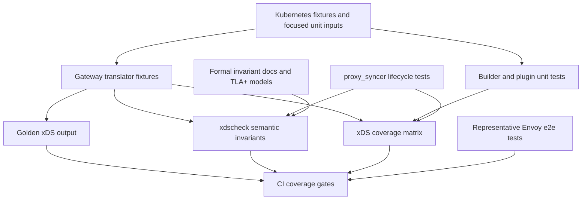

# Design: comprehensive test coverage for xDS code

## Status

Proposed.

## Motivation

kgateway's highest-risk correctness boundary is the Policy -> IR -> xDS pipeline and the per-client xDS publication path. A snapshot can have high line coverage and still be wrong if LDS refers to a missing RDS route, RDS refers to a missing CDS cluster, CDS refers to a missing EDS assignment, SDS secrets are missing, or update/delete ordering leaves go-control-plane unable to answer Envoy's named resource requests.

The goal of this design is to move kgateway from "many useful tests" to a deliberate xDS coverage program. Comprehensive coverage means every xDS-producing feature has:

- Local unit coverage for non-trivial builder and merge logic.
- Translator fixture coverage from Kubernetes inputs to Envoy resources.
- Semantic invariant coverage over emitted xDS snapshots.
- Lifecycle coverage for add, update, delete, reconnect, and per-client readiness cases.
- A small number of e2e tests that prove representative generated config is accepted and behaves in Envoy.

This does not mean every Envoy field is exhaustively tested. It means every kgateway decision that emits, references, withholds, or updates Envoy xDS resources is covered at the cheapest useful layer, and that cross-resource xDS invariants are checked systematically.

## Scope

This plan covers code that creates, validates, publishes, or exposes xDS resources:

- `pkg/kgateway/translator/gateway`
- `pkg/kgateway/translator/irtranslator`
- `pkg/kgateway/extensions2/plugins`
- `pkg/kgateway/proxy_syncer`
- `pkg/kgateway/xds`
- `pkg/kgateway/translator/xdscheck`
- admin snapshot paths that expose xDS output
- translator and e2e tests under `test/translator` and `test/e2e`

The plan also uses the formal-methods seam under `devel/formal` as an xDS invariant source, but it does not require formal proof of every translator function.

## Non-goals

- Do not replace Envoy's own config validation or Envoy integration testing.
- Do not require e2e coverage for every Gateway API or policy field.
- Do not make every translator test inspect every Envoy proto field by hand.
- Do not add a large external dependency for coverage accounting.
- Do not make golden files the only source of truth for correctness.
- Do not test Kubernetes watch semantics exhaustively in xDS translator tests.

## Definition of comprehensive coverage

Coverage is comprehensive when all of these are true:

- Every xDS-producing feature appears in an xDS coverage matrix with an owner, test files, and current status.
- Every valid translator fixture either passes `xdscheck.CheckSnapshot` or has an explicit warning-only allowance for dynamic constructs.
- Every invalid translator fixture asserts status/report behavior and still checks that emitted xDS is internally coherent.
- Every non-trivial plugin IR -> xDS transformation has focused unit tests for defaulting, merge, override, and invalid input behavior.
- Every xDS resource type emitted by kgateway has dependency-closure tests: LDS, RDS, CDS, EDS, and SDS.
- Per-client snapshot publication has lifecycle tests for add, update, delete, reconnect-like UCC changes, retained last-good snapshots, stale endpoint resources, and missing dependency deferral.
- The coverage gate in CI can detect when xDS package coverage or xDS semantic coverage regresses.

## Test architecture



The design separates three questions that are currently easy to blur:

- Did the translator output change? Golden tests answer this.
- Is the output internally coherent xDS? `xdscheck` answers this.
- Does Envoy accept and execute representative output? E2E tests answer this.

## Coverage layers

### Layer 1: focused unit tests

Use unit tests for local logic with small inputs and precise assertions. These should cover:

- Backend translation and cluster construction.
- HCM, filter, route, listener, transport socket, and access log builders.
- Policy merge and override logic.
- Secret and TLS reference resolution.
- Cluster and endpoint hashing/versioning.
- Per-client resource filtering and dependency gates.

Unit tests should not compare huge serialized snapshots. They should assert the specific proto fields or error messages that the local function owns.

### Layer 2: translator golden fixtures

Translator fixtures should remain the main K8s input -> xDS regression suite. They are useful because they catch accidental changes to the complete output shape.

The change is to treat every translator fixture as both:

- A golden-output test.
- A semantic xDS invariant test.

Implementation direction:

1. Add a shared helper in `pkg/kgateway/translator/gateway/gateway_translator_test.go` that converts each `translatortest` result into `xdscheck.Snapshot`.
2. Run `xdscheck.CheckSnapshot` for every translated gateway result after translation.
3. Fail on error-severity findings.
4. Allow warning-severity findings only for known dynamic constructs such as `cluster_header`.
5. Add an opt-out field to `translatorTestCase` only for fixtures that intentionally emit incomplete xDS, and require a reason string.

The existing `TestTranslated*SnapshotPassesXDSCheck` tests prove the seam. The next step is to make that seam generic instead of maintaining one-off tests for selected fixtures.

### Layer 3: semantic xDS invariant tests

`pkg/kgateway/translator/xdscheck` should become the common invariant library for all xDS-producing tests.

Required invariant families:

- Unique resource names by type.
- LDS HCM RDS references resolve to RDS.
- Inline HCM route configs are checked recursively.
- RDS direct and weighted clusters resolve to CDS.
- EDS clusters resolve to CLAs by `service_name` or cluster name.
- Orphan CLAs are rejected.
- SDS references resolve for downstream TLS, upstream TLS, OAuth2, injected credentials, access logs, and recognized tracing providers.
- Ancillary cluster references resolve for OAuth2, JWT remote JWKS, ExtAuthz, ExtProc, RateLimit, access logs, and tracing.
- Unsupported dynamic constructs produce warnings, not panics.

Expansion work should add invariant coverage before adding new fixture variants. The invariant checker gives broad coverage without multiplying golden files.

### Layer 4: proxy syncer lifecycle tests

Some xDS bugs only appear across updates. These belong in `pkg/kgateway/proxy_syncer` tests, not translator goldens.

Required lifecycle scenarios:

- Initial publish after all per-client inputs are ready.
- Deferral when a route references a missing non-errored cluster.
- Deferral when a referenced EDS cluster has no matching CLA.
- Publication when a referenced cluster is explicitly errored.
- Retain-last-good behavior when a computed per-client snapshot is deleted.
- Cluster removal while stale CLAs remain in endpoint inputs.
- Endpoint removal and later re-addition.
- Multi-client snapshots where one client is ready and another is deferred.
- UCC reconnect-like changes where resource versions remain resource-level state.
- Static cluster CLAs are filtered out.
- EDS `service_name` CLAs are kept by service name.

Each published snapshot in these tests should run through `xdscheck` unless the test is specifically constructing an invalid intermediate state.

### Layer 5: property and fuzz tests

Use Go's built-in fuzzing or table-driven generators for bounded xDS inputs. Avoid adding a new property-testing dependency unless a later PR proves that the standard tooling is insufficient.

Useful properties:

- Reordering input routes, policies, or backends does not change semantically sorted output.
- Duplicated input names either collapse deterministically or produce precise report errors.
- Removing a backend cannot leave an orphan CLA in a published snapshot.
- For generated weighted routes, every emitted weighted cluster reference is present in CDS or replaced by blackhole.
- For generated EDS clusters, every required CLA exists and every CLA is required.
- Running translation twice with the same logical input produces the same resource versions.

Property tests should assert invariants and canonical summaries, not entire golden YAML blobs.

### Layer 6: e2e acceptance tests

E2E tests should remain sparse and representative. They prove that Envoy accepts and executes classes of generated config; they should not duplicate every translator fixture.

Representative e2e coverage should include:

- Basic HTTP routing with EDS.
- HTTPS listener and SDS or inline certificate handling.
- Weighted routing.
- Route replacement and invalid-policy blast radius.
- ExtAuthz or ExtProc with an ancillary service cluster.
- OAuth2 or JWT remote JWKS with SDS and ancillary clusters.
- Global rate limit service cluster.
- Backend removal or rollout that exercises endpoint updates.
- Control-plane restart or reconnect smoke for per-client snapshot readiness.

## Coverage matrix

Create an xDS coverage matrix under `devel/testing` or `pkg/kgateway/translator/gateway/testutils`, for example:

```text
devel/testing/xds-coverage-matrix.yaml
```

The matrix should be small and hand-maintained at first. It should record:

- Feature area.
- xDS resource types touched.
- Translator fixture inputs.
- Focused unit test packages.
- Proxy syncer lifecycle tests, if applicable.
- E2E suite, if applicable.
- Known dynamic or unsupported cases.
- Current status: missing, partial, covered, or warning-only.

Example entries:

```yaml
features:
  - name: basic-http-routing
    resources: [LDS, RDS, CDS, EDS]
    translatorFixtures:
      - pkg/kgateway/translator/gateway/testutils/inputs/http-routing/basic.yaml
    invariantTests:
      - TestBasic
      - xdscheck.CheckSnapshot
    lifecycleTests:
      - TestSnapshotPerClientDefersUntilReferencedEDSClustersHaveEndpoints
    e2eSuites:
      - test/e2e/features/basicrouting
    status: covered
  - name: cluster-header
    resources: [RDS]
    dynamicCases:
      - cluster_header route actions cannot be statically resolved
    status: warning-only
```

After the initial matrix exists, add a lightweight test or script that fails if a new translator input directory is added without a corresponding matrix entry.

## Automation plan

### Phase 1: baseline inventory

Add a script or Go test that reports:

- Translator input fixtures.
- Translator output fixtures.
- Fixtures currently checked by `xdscheck`.
- xDS-related unit test packages.
- e2e feature suites that exercise xDS-producing features.

This phase should only report gaps; it should not fail CI.

### Phase 2: generic translator invariant gate

Refactor the current one-off `TestTranslated*SnapshotPassesXDSCheck` tests into a reusable helper and run it for all `TestBasic` cases.

Rules:

- Error findings fail.
- Warning findings are allowed only through a fixture-local allowlist.
- Fixtures that intentionally produce invalid xDS must have an explicit reason and should be rare.

### Phase 3: coverage matrix gate

Add `xds-coverage-matrix.yaml` and make CI fail when:

- A new xDS fixture is not represented in the matrix.
- A matrix entry marked `covered` has no test reference.
- A matrix entry has been `missing` for longer than an agreed grace period.

The goal is a ratchet, not a sudden wall of failures.

### Phase 4: package coverage ratchet

Use existing coverage targets and `test_coverage.yml` to establish package-level baselines for:

- `pkg/kgateway/translator/...`
- `pkg/kgateway/extensions2/plugins/...`
- `pkg/kgateway/proxy_syncer`
- `pkg/kgateway/translator/xdscheck`

Raise thresholds package by package after semantic coverage is in place. Do not use a single global line-coverage target as the primary signal.

### Phase 5: lifecycle and property test expansion

Add focused lifecycle and property tests for the highest-risk classes:

- CDS/EDS coherence.
- LDS/RDS route update coherence.
- SDS reference removal and replacement.
- Multi-client per-client snapshot behavior.
- Gateway and policy deletion.
- Reconnect and retained last-good snapshot behavior.

## CI strategy

Use a layered CI strategy:

- Presubmit: unit tests, translator goldens, generic `xdscheck`, and focused proxy syncer lifecycle tests.
- Presubmit with coverage: package coverage ratchet for xDS packages.
- Nightly: property/fuzz test seed corpus and broader e2e acceptance.
- Manual or release: Envoy config dump comparison for selected high-risk fixtures.

Suggested commands:

```bash
go test ./pkg/kgateway/translator/xdscheck
go test ./pkg/kgateway/translator/gateway
go test ./pkg/kgateway/proxy_syncer
make go-test-with-coverage TEST_PKG=./pkg/kgateway/translator/...,./pkg/kgateway/proxy_syncer
devel/formal/check.sh
```

When using all source code or CI-like settings, include the repo's e2e build tag convention:

```bash
go test -tags e2e ./pkg/kgateway/translator/gateway ./pkg/kgateway/proxy_syncer ./pkg/kgateway/translator/xdscheck
```

## Review checklist for xDS changes

Every PR that changes xDS-producing code should answer:

- Which xDS resources can change?
- Which existing fixture should change?
- Which new fixture is needed?
- Which `xdscheck` invariant covers the dependency closure?
- Which focused unit test covers local builder or merge logic?
- Does the change affect add, update, delete, or reconnect behavior?
- Does any e2e suite need a representative behavior check?
- If warning-only dynamic behavior is introduced, where is it documented and allowlisted?

## Migration plan

1. Add the coverage matrix and inventory report in report-only mode.
2. Convert the selected `xdscheck` translator tests into a generic helper.
3. Run the helper across all valid translator fixtures and fix checker gaps.
4. Add explicit warning allowlists for dynamic constructs.
5. Add proxy syncer lifecycle tests for the remaining high-risk update/delete cases.
6. Add package-level coverage baselines for xDS packages.
7. Add property tests for stable ordering, resource closure, and deterministic versions.
8. Promote matrix gaps from report-only to CI failures once the backlog is small.

## Risks and mitigations

- Risk: Golden files become noisy.
  Mitigation: Use semantic assertions and `xdscheck` for correctness; use goldens for output drift only.

- Risk: `xdscheck` blocks legitimate dynamic Envoy constructs.
  Mitigation: Warning findings and explicit allowlists for constructs that cannot be statically resolved.

- Risk: Coverage thresholds reward low-value tests.
  Mitigation: Use package thresholds as a ratchet after semantic coverage exists.

- Risk: E2E runtime grows too much.
  Mitigation: Keep e2e representative and move field-level coverage to unit and translator tests.

- Risk: Matrix maintenance becomes busywork.
  Mitigation: Keep entries feature-level, not test-case-level, and generate inventory diffs automatically.

## Success criteria

- New xDS features cannot land without an entry in the coverage matrix.
- Valid translator fixtures fail if emitted xDS has unresolved LDS/RDS/CDS/EDS/SDS dependencies.
- Proxy syncer update/delete bugs are covered by lifecycle tests, not only by e2e reproduction.
- Coverage reports show stable or increasing coverage for xDS packages.
- E2E tests cover representative Envoy acceptance and dataplane behavior without duplicating the full translator matrix.
- Future issue investigations can identify the missing coverage layer that would have caught the bug.
